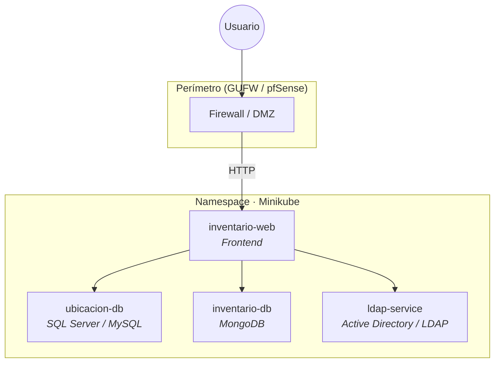

<div align="center">

# Ecosistema de Inventario Seguro

**Proyecto Integrador · EGI · ITU**

Sistema centralizado para inventariar equipos de laboratorios de informática, con despliegue contenerizado, políticas de red Zero-Trust y autenticación institucional.

<br/>

[](https://spring.io/projects/spring-boot)
[](https://kubernetes.io/)
[](https://www.docker.com/)
[](https://www.mongodb.com/)
[](https://www.microsoft.com/sql-server)
[](https://www.openldap.org/)

</div>

---

## Descripción

Sistema web que permite inventariar y gestionar los equipos de los laboratorios del ITU. Combina datos de ubicación/asignación (SQL Server) con datos de hardware (MongoDB) en una API REST, desplegada sobre Kubernetes con autenticación LDAP y políticas de red Zero-Trust.

Consulta el documento completo del enunciado en [`Proyecto Integrador EGI.md`](./Proyecto%20Integrador%20EGI.md) y el informe técnico en [`docs/Informe_EGI_Inventario.md`](./docs/Informe_EGI_Inventario.md).

---

## Arquitectura



| Servicio | Rol | Puerto |
|----------|-----|--------|
| `inventario-web` | Interfaz y lógica de aplicación | _Por definir_ |
| `ubicacion-db` | Ubicación, responsables, mantenimiento | _Por definir_ |
| `inventario-db` | Hardware y componentes internos | _Por definir_ |
| `ldap-service` | Autenticación institucional | _Por definir_ |

<!-- TODO: Diagrama de red, NetworkPolicies y reglas de firewall -->

---

## Stack tecnológico

| Capa | Tecnologías |
|------|-------------|
| **Backend** | Spring Boot, Java |
| **Frontend** | _Por definir_ |
| **Datos** | SQL Server / MySQL, MongoDB |
| **Identidad** | Active Directory / LDAP |
| **Infraestructura** | Docker, Kubernetes (Minikube), Calico |
| **Seguridad** | Network Policies, GUFW / pfSense |

---

## Estructura del repositorio

```
egi-inventario-seguro/
├── app/
│   └── inventario-web/           # Spring Boot (API REST + Frontend)
│       ├── pom.xml
│       └── src/
│           ├── main/
│           │   ├── java/com/itu/egi/inventarioseguro/
│           │   │   ├── config/   # DataSourceConfig (JPA + MongoDB)
│           │   │   ├── model/    # Entidades JPA, documento MongoDB, enums
│           │   │   ├── repository/sql/    # Repos JPA
│           │   │   ├── repository/mongo/  # Repos MongoDB
│           │   │   ├── dto/      # DTOs de request y response
│           │   │   ├── service/  # Lógica de negocio
│           │   │   └── controller/ # Endpoints REST /api/*
│           │   └── resources/
│           │       ├── application.yml
│           │       └── db/migration/  # Flyway V1–V4
│           └── test/
├── docs/                         # Informe, diagramas
├── migraciones/
│   ├── sql/                      # V1–V4 (referencia)
│   └── mongodb/                  # Schema de colección
└── README.md
```

---

## Requisitos previos

- Java 17+
- Maven 3.9+
- Docker Desktop
- Minikube (`minikube start --cni=calico`) y kubectl — para despliegue en clúster
- IntelliJ IDEA (recomendado) u otro IDE compatible con Spring Boot

> **Nota**: el `docker-compose.dev.yml` levanta SQL Server en el puerto **1433** y MongoDB en el **27018** (no 27017, para evitar conflicto con instalaciones locales de MongoDB).

---

## Inicio rápido (desarrollo local)

```bash
# 1. Clonar el repositorio
git clone <url-del-repositorio>
cd egi-inventario-seguro

# 2. Levantar las bases de datos con Docker Compose
docker compose -f docker-compose.dev.yml up -d

# 3. Configurar variables de entorno en el IDE
#    DB_PASSWORD=EGI_Password123!
#    (DB_USER y MONGO_URI tienen valores por defecto en application.yml)

# 4. Compilar y ejecutar el backend desde IntelliJ
#    o desde terminal:
cd app/inventario-web
mvn spring-boot:run -Dspring-boot.run.jvmArguments="-DDB_PASSWORD=EGI_Password123!"

# 5. La API queda disponible en http://localhost:8080/api
```

---

## Despliegue con Docker

Levanta la **aplicación** (Spring Boot + frontend embebido) y **MongoDB**. **SQL Server corre en una VM externa** (no incluido en este compose).

```bash
cp .env.example .env
# Editar .env: DB_URL y DB_PASSWORD apuntando a la VM de SQL Server
docker compose up --build -d
```

| Servicio | Dónde corre | URL (ejemplo local) |
|----------|-------------|---------------------|
| App (API + UI) | Contenedor Docker | http://localhost:8080 |
| API REST | Mismo contenedor | http://localhost:8080/api |
| MongoDB | Contenedor Docker | red interna (`mongodb:27017`) |
| SQL Server | **VM externa** | configurado en `DB_URL` del `.env` |

El frontend React se compila durante `mvn package` (via `frontend-maven-plugin`) y se sirve como estático desde Spring Boot. No hay contenedor nginx separado.

### Generar las imágenes Docker

| Imagen | Origen | Descripción |
|--------|--------|-------------|
| `almacenamiento-seguro-backend` | [`app/inventario-web/Dockerfile`](app/inventario-web/Dockerfile) | Spring Boot + frontend embebido |
| `mongo:7` | Docker Hub | Base de datos MongoDB |

**Construir todas las imágenes** (sin levantar contenedores):

```bash
cp .env.example .env
docker compose build
```

**Construir la imagen de la aplicación:**

```bash
docker build -t almacenamiento-seguro-backend ./app/inventario-web
```

**Verificar que las imágenes existen:**

```bash
docker images | grep -E "almacenamiento-seguro|mongo"
```

**Exportar para otra máquina** (sin reconstruir en el destino):

```bash
docker save almacenamiento-seguro-backend mongo:7 \
  -o inventario-seguro-images.tar
```

En el servidor destino:

```bash
docker load -i inventario-seguro-images.tar
cp .env.example .env   # configurar y luego: docker compose up -d
```

### Preparar la VM de SQL Server

1. Instalar SQL Server en la VM y abrir el puerto **1433** hacia el host donde corre Docker.
2. Crear la base de datos (una sola vez):

```bash
sqlcmd -S localhost -U sa -P '<password>' -C -i migraciones/sql/V0__create_database.sql
```

3. Configurar en `.env` la conexión hacia la VM:

```env
DB_URL=jdbc:sqlserver://<ip-o-hostname-vm>:1433;databaseName=inventario_egi;encrypt=true;trustServerCertificate=true
DB_USER=sa
DB_PASSWORD=<password>
```

Flyway aplica las migraciones V1–V4 al arrancar el backend.

Documentación detallada en [`docs/Informe_EGI_Inventario.md`](docs/Informe_EGI_Inventario.md) (secciones 11.7 y 11.8).

### Desarrollo local con SQL Server en Docker

Para probar sin VM externa, levanta SQL Server con el compose de desarrollo y apunta el backend al host:

```bash
docker compose -f docker-compose.dev.yml up -d
cp .env.example .env
# En .env, usar:
# DB_URL=jdbc:sqlserver://host.docker.internal:1433;databaseName=inventario_egi;encrypt=false;trustServerCertificate=true
# DB_PASSWORD=EGI_Password123!
docker compose up --build -d
```

### Seed de MongoDB (opcional)

Tras el primer arranque, puedes cargar documentos de ejemplo:

```bash
docker compose exec -T mongodb mongosh inventario_egi --quiet < migraciones/mongodb/V3__seed_maquina_documents.js
```

### Endpoints disponibles

| Método | Ruta | Descripción |
|--------|------|-------------|
| GET | `/api/maquinas` | Listar todas las máquinas |
| GET | `/api/maquinas/{id}` | Detalle unificado (SQL + MongoDB) |
| POST | `/api/maquinas` | Crear máquina |
| PUT | `/api/maquinas/{id}` | Actualizar máquina |
| DELETE | `/api/maquinas/{id}` | Eliminar máquina |
| GET | `/api/maquinas/{id}/personas` | Personas asignadas |
| GET | `/api/personas` | Listar personas |
| POST | `/api/personas` | Crear persona |
| PUT | `/api/personas/{id}` | Actualizar persona |
| DELETE | `/api/personas/{id}` | Eliminar persona |
| POST | `/api/asignaciones` | Asignar máquina a persona |
| DELETE | `/api/asignaciones/{personaId}/{maquinaId}` | Desasignar |

---

## Despliegue en Kubernetes (Minikube + pfSense)

Orden recomendado: **levantar conectividad primero y aplicar las NetworkPolicies al final**. Detalle completo en el informe (§6.5 pfSense, §6.1 Calico, §7.4 orden de despliegue).

```bash
# 1. Iniciar el clúster CON Calico (el CNI se elige al crear el clúster; no se agrega después)
minikube start --cni=calico

# 2. Habilitar el Ingress Controller
minikube addons enable ingress

# 3. Aplicar los manifiestos (config -> datos -> app -> red), incluido el NodePort 30443
kubectl apply -f k8s/namespace.yaml
kubectl apply -f k8s/configmap.yaml -f k8s/01-config/secret.yaml
kubectl apply -f k8s/storage/mongodb-pvc.yaml -f k8s/deployments/mongodb.yaml -f k8s/services/mongodb.yaml
kubectl apply -f k8s/deployments/inventario-web.yaml -f k8s/services/inventario-web.yaml
kubectl apply -f k8s/ingress/inventario-ingress.yaml
kubectl apply -f k8s/ingress/ingress-nginx-nodeport.yaml   # expone el 30443

# 4. Configurar pfSense (port forward WAN:443 -> 192.168.10.40:30443) y probar SIN políticas -> debe responder

# 5. Aplicar las NetworkPolicies (denegación total + 4 permisos, JUNTOS)
kubectl apply -f k8s/network-policies/
```

> **Tres cosas que rompen el despliegue si no se respetan:**
> 1. **Calico va al inicio.** Sin `--cni=calico` al crear el clúster, las NetworkPolicies no surten efecto y agregarlo después obliga a recrear el clúster.
> 2. **El NodePort 30443 debe ser alcanzable en la IP de la VM4** (`192.168.10.40`). Según el driver de Minikube puede quedar interno; usar `--driver=none`, `minikube tunnel` o reenvío en la VM.
> 3. **Al aplicar `default-deny-all`, el 30443 deja de responder** hasta que esté `allow-ingress-to-web`. Aplicar denegación y permisos en un solo paso.

> **Nota:** los manifiestos `k8s/` (monolito `inventario-web`) provienen de la rama `devops`; este README los referencia para el flujo unificado.

---

## Equipo

| Integrante | Rol / módulo a defender |
|------------|-------------------------|
| _Nombre_ | _Por asignar_ |
| _Nombre_ | _Por asignar_ |
| _Nombre_ | _Por asignar_ |
| _Nombre_ | _Por asignar_ |
| _Nombre_ | _Por asignar_ |

---

## Entregables

- [ ] Esquema de arquitectura (servicios, puertos, reglas de red)
- [ ] Modelo y scripts de bases de datos + JSON de documentos
- [ ] Aplicación web con flujograma
- [ ] Manifiestos Kubernetes y Network Policies
- [ ] Ecosistema funcional en Minikube
- [ ] Presentación (PowerPoint o similar)
- [ ] Repositorio Git con historial de evolución

---

## Documentación

| Recurso | Descripción |
|---------|-------------|
| [`Proyecto Integrador EGI.md`](./Proyecto%20Integrador%20EGI.md) | Enunciado y requisitos del proyecto |
| [`docs/Informe_EGI_Inventario.md`](./docs/Informe_EGI_Inventario.md) | Informe técnico completo: arquitectura, modelo de datos, backend, despliegue Docker (§11.7–11.8), seguridad |
| [`.env.example`](./.env.example) | Plantilla de variables para `docker compose up` |
| `docs/` | Diagramas de topología, clases y flujo de la aplicación |

---

## Licencia

<!-- TODO: Definir licencia si aplica -->

_Por definir._

---

<div align="center">

**ITU · EGI · 2026**

</div>
