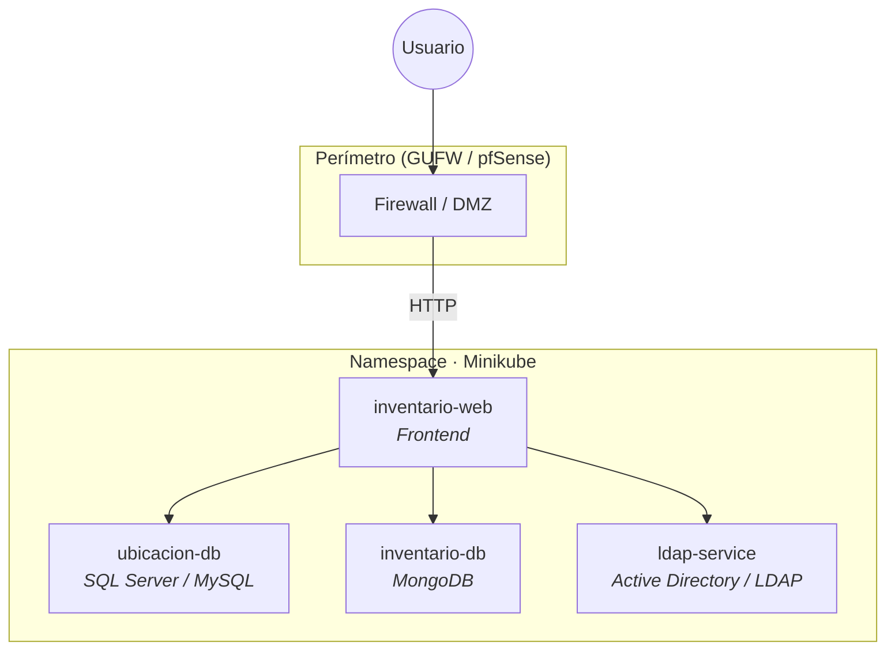

<div align="center">

# Ecosistema de Inventario Seguro

**Proyecto Integrador · EGI · ITU**

Sistema centralizado para inventariar equipos de laboratorios de informática, con despliegue contenerizado, políticas de red Zero-Trust y autenticación institucional.

<br/>

[](https://spring.io/projects/spring-boot)
[](https://kubernetes.io/)
[](https://www.docker.com/)
[](https://www.mongodb.com/)
[](https://www.microsoft.com/sql-server)
[](https://www.openldap.org/)

</div>

---

## Descripción

Sistema web que permite inventariar y gestionar los equipos de los laboratorios del ITU. Combina datos de ubicación/asignación (SQL Server) con datos de hardware (MongoDB) en una API REST, desplegada sobre Kubernetes con autenticación LDAP y políticas de red Zero-Trust.

Consulta el documento completo del enunciado en [`Proyecto Integrador EGI.md`](./Proyecto%20Integrador%20EGI.md) y el informe técnico en [`docs/Informe_EGI_Inventario.md`](./docs/Informe_EGI_Inventario.md).

---

## Arquitectura



| Servicio | Rol | Puerto |
|----------|-----|--------|
| `inventario-web` | Interfaz y lógica de aplicación | _Por definir_ |
| `ubicacion-db` | Ubicación, responsables, mantenimiento | _Por definir_ |
| `inventario-db` | Hardware y componentes internos | _Por definir_ |
| `ldap-service` | Autenticación institucional | _Por definir_ |

<!-- TODO: Diagrama de red, NetworkPolicies y reglas de firewall -->

---

## Stack tecnológico

| Capa | Tecnologías |
|------|-------------|
| **Backend** | Spring Boot, Java |
| **Frontend** | _Por definir_ |
| **Datos** | SQL Server / MySQL, MongoDB |
| **Identidad** | Active Directory / LDAP |
| **Infraestructura** | Docker, Kubernetes (Minikube), Calico |
| **Seguridad** | Network Policies, GUFW / pfSense |

---

## Estructura del repositorio

```
egi-inventario-seguro/
├── app/
│   └── inventario-web/           # Spring Boot (API REST + Frontend)
│       ├── pom.xml
│       └── src/
│           ├── main/
│           │   ├── java/com/itu/egi/inventarioseguro/
│           │   │   ├── config/   # DataSourceConfig (JPA + MongoDB)
│           │   │   ├── model/    # Entidades JPA, documento MongoDB, enums
│           │   │   ├── repository/sql/    # Repos JPA
│           │   │   ├── repository/mongo/  # Repos MongoDB
│           │   │   ├── dto/      # DTOs de request y response
│           │   │   ├── service/  # Lógica de negocio
│           │   │   └── controller/ # Endpoints REST /api/*
│           │   └── resources/
│           │       ├── application.yml
│           │       └── db/migration/  # Flyway V1–V4
│           └── test/
├── docs/                         # Informe, diagramas
├── migraciones/
│   ├── sql/                      # V1–V4 (referencia)
│   └── mongodb/                  # Schema de colección
└── README.md
```

---

## Requisitos previos

- Java 17+
- Maven 3.9+
- Docker Desktop
- Minikube (`minikube start --cni=calico`) y kubectl — para despliegue en clúster
- IntelliJ IDEA (recomendado) u otro IDE compatible con Spring Boot

> **Nota**: el `docker-compose.dev.yml` levanta SQL Server en el puerto **1433** y MongoDB en el **27018** (no 27017, para evitar conflicto con instalaciones locales de MongoDB).

---

## Inicio rápido (desarrollo local)

```bash
# 1. Clonar el repositorio
git clone <url-del-repositorio>
cd egi-inventario-seguro

# 2. Levantar las bases de datos con Docker Compose
docker compose -f docker-compose.dev.yml up -d

# 3. Configurar variables de entorno en el IDE
#    DB_PASSWORD=EGI_Password123!
#    (DB_USER y MONGO_URI tienen valores por defecto en application.yml)

# 4. Compilar y ejecutar el backend desde IntelliJ
#    o desde terminal:
cd app/inventario-web
mvn spring-boot:run -Dspring-boot.run.jvmArguments="-DDB_PASSWORD=EGI_Password123!"

# 5. La API queda disponible en http://localhost:8080/api
```

### Endpoints disponibles

| Método | Ruta | Descripción |
|--------|------|-------------|
| GET | `/api/maquinas` | Listar todas las máquinas |
| GET | `/api/maquinas/{id}` | Detalle unificado (SQL + MongoDB) |
| POST | `/api/maquinas` | Crear máquina |
| PUT | `/api/maquinas/{id}` | Actualizar máquina |
| DELETE | `/api/maquinas/{id}` | Eliminar máquina |
| GET | `/api/maquinas/{id}/personas` | Personas asignadas |
| GET | `/api/personas` | Listar personas |
| POST | `/api/personas` | Crear persona |
| PUT | `/api/personas/{id}` | Actualizar persona |
| DELETE | `/api/personas/{id}` | Eliminar persona |
| POST | `/api/asignaciones` | Asignar máquina a persona |
| DELETE | `/api/asignaciones/{personaId}/{maquinaId}` | Desasignar |

---

## Equipo

| Integrante | Rol / módulo a defender |
|------------|-------------------------|
| _Nombre_ | _Por asignar_ |
| _Nombre_ | _Por asignar_ |
| _Nombre_ | _Por asignar_ |
| _Nombre_ | _Por asignar_ |
| _Nombre_ | _Por asignar_ |

---

## Entregables

- [ ] Esquema de arquitectura (servicios, puertos, reglas de red)
- [ ] Modelo y scripts de bases de datos + JSON de documentos
- [ ] Aplicación web con flujograma
- [ ] Manifiestos Kubernetes y Network Policies
- [ ] Ecosistema funcional en Minikube
- [ ] Presentación (PowerPoint o similar)
- [ ] Repositorio Git con historial de evolución

---

## Documentación

| Recurso | Descripción |
|---------|-------------|
| [`Proyecto Integrador EGI.md`](./Proyecto%20Integrador%20EGI.md) | Enunciado y requisitos del proyecto |
| [`docs/Informe_EGI_Inventario.md`](./docs/Informe_EGI_Inventario.md) | Informe técnico completo: arquitectura, modelo de datos, backend, seguridad |
| `docs/` | Diagramas de topología, clases y flujo de la aplicación |

---

## Licencia

<!-- TODO: Definir licencia si aplica -->

_Por definir._

---

<div align="center">

**ITU · EGI · 2026**

</div>
