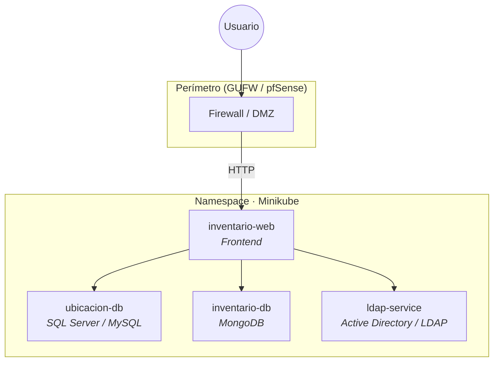

<div align="center">

# Ecosistema de Inventario Seguro

**Proyecto Integrador · EGI · ITU**

Sistema centralizado para inventariar equipos de laboratorios de informática, con despliegue contenerizado, políticas de red Zero-Trust y autenticación institucional.

<br/>

[](https://spring.io/projects/spring-boot)
[](https://kubernetes.io/)
[](https://www.docker.com/)
[](https://www.mongodb.com/)
[](https://www.microsoft.com/sql-server)
[](https://www.openldap.org/)

</div>

---

## Descripción

<!-- TODO: Resumen ejecutivo del proyecto (2–3 párrafos) -->

> _Por completar: contexto del problema, alcance y objetivos principales._

Consulta el documento completo del enunciado en [`Proyecto Integrador EGI.md`](./Proyecto%20Integrador%20EGI.md).

---

## Arquitectura



| Servicio | Rol | Puerto |
|----------|-----|--------|
| `inventario-web` | Interfaz y lógica de aplicación | _Por definir_ |
| `ubicacion-db` | Ubicación, responsables, mantenimiento | _Por definir_ |
| `inventario-db` | Hardware y componentes internos | _Por definir_ |
| `ldap-service` | Autenticación institucional | _Por definir_ |

<!-- TODO: Diagrama de red, NetworkPolicies y reglas de firewall -->

---

## Stack tecnológico

| Capa | Tecnologías |
|------|-------------|
| **Backend** | Spring Boot, Java |
| **Frontend** | _Por definir_ |
| **Datos** | SQL Server / MySQL, MongoDB |
| **Identidad** | Active Directory / LDAP |
| **Infraestructura** | Docker, Kubernetes (Minikube), Calico |
| **Seguridad** | Network Policies, GUFW / pfSense |

---

## Estructura del repositorio

<!-- TODO: Actualizar cuando existan las carpetas -->

```
EGI/
├── docs/                 # Esquemas, diagramas, presentación
├── inventario-web/       # Frontend
├── k8s/                  # Manifiestos Kubernetes
├── services/             # Microservicios Spring Boot
├── database/             # Scripts SQL, JSON de seed MongoDB
└── README.md
```

---

## Requisitos previos

<!-- TODO: Versiones exactas -->

- [ ] Java 17+
- [ ] Maven o Gradle
- [ ] Docker
- [ ] Minikube (`minikube start --cni=calico`)
- [ ] kubectl

---

## Inicio rápido

<!-- TODO: Comandos reales cuando el ecosistema esté armado -->

```bash
# 1. Clonar el repositorio
git clone <url-del-repositorio>
cd EGI

# 2. Levantar el clúster local
minikube start --cni=calico

# 3. Desplegar el ecosistema
# kubectl apply -f k8s/

# 4. Acceder a la aplicación
# minikube service inventario-web
```

---

## Equipo

| Integrante | Rol / módulo a defender |
|------------|-------------------------|
| _Nombre_ | _Por asignar_ |
| _Nombre_ | _Por asignar_ |
| _Nombre_ | _Por asignar_ |
| _Nombre_ | _Por asignar_ |
| _Nombre_ | _Por asignar_ |

---

## Entregables

- [ ] Esquema de arquitectura (servicios, puertos, reglas de red)
- [ ] Modelo y scripts de bases de datos + JSON de documentos
- [ ] Aplicación web con flujograma
- [ ] Manifiestos Kubernetes y Network Policies
- [ ] Ecosistema funcional en Minikube
- [ ] Presentación (PowerPoint o similar)
- [ ] Repositorio Git con historial de evolución

---

## Documentación

| Recurso | Descripción |
|---------|-------------|
| [`Proyecto Integrador EGI.md`](./Proyecto%20Integrador%20EGI.md) | Enunciado y requisitos del proyecto |
| `docs/` | _Por crear: diagramas, flujos, defensa_ |

---

## Licencia

<!-- TODO: Definir licencia si aplica -->

_Por definir._

---

<div align="center">

**ITU · EGI · 2026**

</div>
