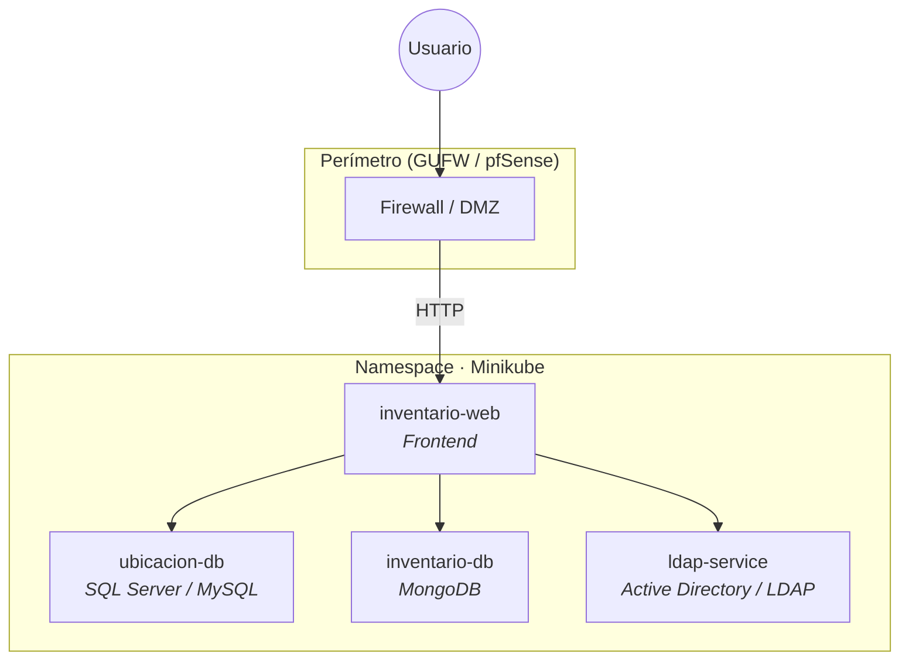

<div align="center">

# Ecosistema de Inventario Seguro

**Proyecto Integrador · EGI · ITU**

Sistema centralizado para inventariar equipos de laboratorios de informática, con despliegue contenerizado, políticas de red Zero-Trust y autenticación institucional.

<br/>

[](https://spring.io/projects/spring-boot)
[](https://kubernetes.io/)
[](https://www.docker.com/)
[](https://www.mongodb.com/)
[](https://www.microsoft.com/sql-server)
[](https://www.openldap.org/)

</div>

---

## Descripción

Sistema web que permite inventariar y gestionar los equipos de los laboratorios del ITU. Combina datos de ubicación/asignación (SQL Server) con datos de hardware (MongoDB) en una API REST, desplegada sobre Kubernetes con autenticación LDAP y políticas de red Zero-Trust.

Consulta el documento completo del enunciado en [`Proyecto Integrador EGI.md`](./Proyecto%20Integrador%20EGI.md) y el informe técnico en [`docs/Informe_EGI_Inventario.md`](./docs/Informe_EGI_Inventario.md).

---

## Arquitectura



| Servicio | Rol | Puerto |
|----------|-----|--------|
| `inventario-web` | Interfaz y lógica de aplicación (Spring Boot + React) | 8080 |
| `ubicacion-db` | Ubicación, responsables, mantenimiento (SQL Server, VM externa) | 1433 |
| `inventario-db` | Hardware y componentes internos (MongoDB) | 27017 |
| `ldap-service` | Autenticación institucional (Active Directory, VM externa) | 389 / 636 |

---

## Stack tecnológico

| Capa | Tecnologías |
|------|-------------|
| **Backend** | Spring Boot, Java |
| **Frontend** | React 19, TypeScript, Vite 6, Tailwind CSS 4 |
| **Datos** | SQL Server / MySQL, MongoDB |
| **Identidad** | Active Directory / LDAP |
| **Infraestructura** | Docker, Kubernetes (Minikube), Calico |
| **Seguridad** | Network Policies, GUFW / pfSense |

---

## Estructura del repositorio

```
egi-inventario-seguro/
├── app/
│   └── inventario-web/                # Spring Boot (API REST + Frontend embebido)
│       ├── Dockerfile                 # Multi-stage: Maven build + JRE Alpine
│       ├── pom.xml
│       ├── frontend/                  # React 19 + Vite + Tailwind CSS
│       │   ├── src/
│       │   │   ├── components/        # LoginScreen, MaquinaDetailDrawer, MaquinaCrudModal
│       │   │   ├── services/          # api.ts, authService.ts, maquinaService.ts
│       │   │   └── types.ts           # Tipos TypeScript del dominio
│       │   ├── package.json
│       │   └── vite.config.ts
│       └── src/
│           ├── main/
│           │   ├── java/com/itu/egi/inventarioseguro/
│           │   │   ├── config/        # DataSourceConfig (JPA + MongoDB), SecurityConfig, CorsConfig
│           │   │   ├── model/         # Entidades JPA, documento MongoDB, enums
│           │   │   ├── repository/sql/    # Repos JPA (Persona, Maquina, PersonaMaquina)
│           │   │   ├── repository/mongo/  # Repos MongoDB (MaquinaHardware)
│           │   │   ├── dto/           # DTOs de request y response
│           │   │   ├── security/      # JwtService, JwtFilter, LdapAuthenticationService, RoleMapper
│           │   │   ├── service/       # Lógica de negocio
│           │   │   └── controller/    # Endpoints REST /api/* + SpaController
│           │   └── resources/
│           │       ├── application.yml
│           │       ├── db/migration/  # Flyway V1–V4
│           │       └── static/        # Frontend compilado (generado por maven build)
│           └── test/                  # 17 tests: service, controller, auth
├── docker-compose.yml                 # Producción: app + MongoDB (SQL Server en VM externa)
├── docker-compose.dev.yml             # Desarrollo: SQL Server + MongoDB en Docker
├── docker/
│   └── sqlserver/init.sql             # Creación de BD para compose de desarrollo
├── docs/                              # Informe técnico, diagramas PNG
├── k8s/                               # Manifiestos Kubernetes
│   ├── namespace.yaml
│   ├── configmap.yaml
│   ├── deployments/                   # inventario-web, mongodb
│   ├── services/                      # inventario-web, mongodb
│   ├── ingress/                       # inventario-ingress, ingress-nginx-nodeport
│   ├── network-policies/              # default-deny-all + 3 allow rules
│   └── storage/                       # mongodb-pvc
├── firewall/
│   └── reglas_pfsense.md              # Diseño de red pfSense, configuración paso a paso
├── migraciones/
│   ├── sql/                           # V0–V4 (referencia, también en resources/db/migration)
│   └── mongodb/                       # Schema, seed, demo CRUD
├── .env.example                       # Plantilla de variables para docker compose
└── README.md
```

---

## Requisitos previos

- Java 17+
- Maven 3.9+
- Docker Desktop
- Minikube (`minikube start --cni=calico`) y kubectl — para despliegue en clúster
- IntelliJ IDEA (recomendado) u otro IDE compatible con Spring Boot

> **Nota**: el `docker-compose.dev.yml` levanta SQL Server en el puerto **1433** y MongoDB en el **27018** (no 27017, para evitar conflicto con instalaciones locales de MongoDB).

---

## Inicio rápido (desarrollo local)

```bash
# 1. Clonar el repositorio
git clone <url-del-repositorio>
cd egi-inventario-seguro

# 2. Levantar las bases de datos con Docker Compose
docker compose -f docker-compose.dev.yml up -d

# 3. Configurar variables de entorno en el IDE
#    DB_PASSWORD=EGI_Password123!
#    (DB_USER y MONGO_URI tienen valores por defecto en application.yml)

# 4. Compilar y ejecutar el backend desde IntelliJ
#    o desde terminal:
cd app/inventario-web
mvn spring-boot:run -Dspring-boot.run.jvmArguments="-DDB_PASSWORD=EGI_Password123!"

# 5. La API queda disponible en http://localhost:8080/api
```

---

## Despliegue con Docker

Levanta la **aplicación** (Spring Boot + frontend embebido) y **MongoDB**. **SQL Server corre en una VM externa** (no incluido en este compose).

```bash
cp .env.example .env
# Editar .env: DB_URL y DB_PASSWORD apuntando a la VM de SQL Server
docker compose up --build -d
```

| Servicio | Dónde corre | URL (ejemplo local) |
|----------|-------------|---------------------|
| App (API + UI) | Contenedor Docker | http://localhost:8080 |
| API REST | Mismo contenedor | http://localhost:8080/api |
| MongoDB | Contenedor Docker | red interna (`mongodb:27017`) |
| SQL Server | **VM externa** | configurado en `DB_URL` del `.env` |

El frontend React se compila durante `mvn package` (via `frontend-maven-plugin`) y se sirve como estático desde Spring Boot. No hay contenedor nginx separado.

### Generar las imágenes Docker

| Imagen | Origen | Descripción |
|--------|--------|-------------|
| `almacenamiento-seguro-backend` | [`app/inventario-web/Dockerfile`](app/inventario-web/Dockerfile) | Spring Boot + frontend embebido |
| `mongo:7` | Docker Hub | Base de datos MongoDB |

**Construir todas las imágenes** (sin levantar contenedores):

```bash
cp .env.example .env
docker compose build
```

**Construir la imagen de la aplicación:**

```bash
docker build -t almacenamiento-seguro-backend ./app/inventario-web
```

**Verificar que las imágenes existen:**

```bash
docker images | grep -E "almacenamiento-seguro|mongo"
```

**Exportar para otra máquina** (sin reconstruir en el destino):

```bash
docker save almacenamiento-seguro-backend mongo:7 \
  -o inventario-seguro-images.tar
```

En el servidor destino:

```bash
docker load -i inventario-seguro-images.tar
cp .env.example .env   # configurar y luego: docker compose up -d
```

### Preparar la VM de SQL Server

1. Instalar SQL Server en la VM y abrir el puerto **1433** hacia el host donde corre Docker.
2. Crear la base de datos (una sola vez):

```bash
sqlcmd -S localhost -U sa -P '<password>' -C -i migraciones/sql/V0__create_database.sql
```

3. Configurar en `.env` la conexión hacia la VM:

```env
DB_URL=jdbc:sqlserver://<ip-o-hostname-vm>:1433;databaseName=inventario_egi;encrypt=true;trustServerCertificate=true
DB_USER=sa
DB_PASSWORD=<password>
```

Flyway aplica las migraciones V1–V4 al arrancar el backend.

Documentación detallada en [`docs/Informe_EGI_Inventario.md`](docs/Informe_EGI_Inventario.md) (secciones 11.7 y 11.8).

### Desarrollo local con SQL Server en Docker

Para probar sin VM externa, levanta SQL Server con el compose de desarrollo y apunta el backend al host:

```bash
docker compose -f docker-compose.dev.yml up -d
cp .env.example .env
# En .env, usar:
# DB_URL=jdbc:sqlserver://host.docker.internal:1433;databaseName=inventario_egi;encrypt=false;trustServerCertificate=true
# DB_PASSWORD=EGI_Password123!
docker compose up --build -d
```

### Seed de MongoDB (opcional)

Tras el primer arranque, puedes cargar documentos de ejemplo:

```bash
docker compose exec -T mongodb mongosh inventario_egi --quiet < migraciones/mongodb/V3__seed_maquina_documents.js
```

### Endpoints disponibles

| Método | Ruta | Descripción | Auth |
|--------|------|-------------|------|
| POST | `/api/auth/login` | Autenticar con LDAP, retorna JWT | ✗ |
| GET | `/api/maquinas` | Listar todas las máquinas | ✓ JWT |
| GET | `/api/maquinas/{id}` | Detalle unificado (SQL + MongoDB) | ✓ JWT |
| POST | `/api/maquinas` | Crear máquina | ✓ EDITOR |
| PUT | `/api/maquinas/{id}` | Actualizar máquina | ✓ EDITOR |
| DELETE | `/api/maquinas/{id}` | Eliminar máquina | ✓ ADMIN |
| GET | `/api/personas` | Listar personas | ✓ JWT |
| POST | `/api/personas` | Crear persona | ✓ ADMIN |
| PUT | `/api/personas/{id}` | Actualizar persona | ✓ ADMIN |
| DELETE | `/api/personas/{id}` | Eliminar persona | ✓ ADMIN |
| POST | `/api/asignaciones` | Asignar máquina a persona | ✓ EDITOR |
| DELETE | `/api/asignaciones/{personaId}/{maquinaId}` | Desasignar | ✓ EDITOR |

---

## Despliegue en Kubernetes (Minikube + pfSense)

### Topología de red

```
                 Internet/WAN
                      |
                  pfSense (VM1)
                      |
            Red interna "egi-lan" (192.168.10.0/24)
         /              |              |              \
    Windows-AD      Windows-SQL    Ubuntu VM4      pfSense WAN
    (192.168.10.102)  (192.168.10.101) (192.168.10.103)  (VirtualBox NAT)
    LDAP (389)      SQL (1433)      Minikube
    DNS (53)                        NodePort 30443
```

**Flujo de request externo:**
```
Cliente WAN → pfSense WAN:443 → [NAT] → Ubuntu:30443 → ingress-nginx → inventario-web:8080
```

### Configuración de Ubuntu VM (Minikube + Calico)

1. **SSH a la VM**:
   ```bash
   ssh -p 2222 gonza2001@<WINDOWS_HOST_IP>  # VirtualBox port forward
   ```

2. **Iniciar Minikube CON Calico** (crítico: CNI debe estar en la creación):
   ```bash
   minikube start --cni=calico --driver=docker --memory=4096 --cpus=2
   minikube addons enable ingress
   ```

3. **Aplicar manifiestos** (orden: config → datos → app → red):
   ```bash
   kubectl apply -f k8s/namespace.yaml
   kubectl apply -f k8s/configmap.yaml
   
   # Crear los Secrets (NO están en el repo)
   kubectl -n inventario-seguro create secret generic sql-secret \
     --from-literal=DB_PASSWORD='Itu12345!'
   kubectl -n inventario-seguro create secret generic ldap-secret \
     --from-literal=LDAP_BIND_DN='cn=Administrador,cn=Users,dc=itu,dc=local' \
     --from-literal=LDAP_BIND_PASSWORD='Itu12345!'
   kubectl -n inventario-seguro create secret generic mongo-secret
   kubectl -n inventario-seguro create secret generic jwt-secret \
     --from-literal=JWT_SECRET='SecretKeyForEGIIinventarioSeguroNeedsToBeAtLeast32BytesLong...'
   
   # Storage + MongoDB
   kubectl apply -f k8s/storage/mongodb-pvc.yaml -f k8s/deployments/mongodb.yaml -f k8s/services/mongodb.yaml
   
   # App (esperar a que MongoDB esté Ready)
   kubectl apply -f k8s/deployments/inventario-web.yaml -f k8s/services/inventario-web.yaml
   
   # Ingress + NodePort para pfSense
   kubectl apply -f k8s/ingress/inventario-ingress.yaml
   kubectl apply -f k8s/ingress/ingress-nginx-nodeport.yaml
   
   # NetworkPolicies (denegación total + 4 permisos, JUNTOS)
   kubectl apply -f k8s/network-policies/
   ```

4. **Exponer el NodePort externamente** (systemd service en Ubuntu):
   ```bash
   sudo tee /etc/systemd/system/egi-portforward.service > /dev/null <<'EOF'
   [Unit]
   Description=EGI Inventario - kubectl port-forward
   After=docker.service network-online.target
   Wants=docker.service
   
   [Service]
   User=gonza2001
   Environment=HOME=/home/gonza2001
   ExecStartPre=/bin/bash -c "minikube status | grep -q Running || minikube start --cni=calico --driver=docker"
   ExecStartPre=/bin/sleep 15
   ExecStart=/usr/local/bin/kubectl port-forward -n ingress-nginx svc/ingress-nginx-pfsense-nodeport 30443:443 --address=0.0.0.0
   Restart=always
   RestartSec=15
   
   [Install]
   WantedBy=multi-user.target
   EOF
   sudo systemctl daemon-reload && sudo systemctl enable --now egi-portforward
   ```

### Configuración de pfSense (VM1)

1. **Interfaces**:
   - **WAN**: Adaptador puente o NAT (salida a internet)
   - **LAN**: Red interna `egi-lan`, IP `192.168.10.1/24`

2. **DHCP + Outbound NAT** (ya configurado):
   - DHCP en LAN: `192.168.10.150`–`192.168.10.200`
   - Outbound NAT: enmascara `192.168.10.0/24` por WAN

3. **Bloqueo de redes privadas**: DESHABILITADO en WAN (permite NAT desde redes privadas)

4. **Port Forward** (lo importante):
   - Interface: **WAN**
   - Protocolo: **TCP**
   - Destino: **WAN address**
   - Puerto destino: **443**
   - Redirect IP: **192.168.10.103** (Ubuntu VM4)
   - Redirect puerto: **30443**
   - Crear regla de firewall asociada: ✓

5. **Reglas de Firewall**:
   - **WAN**: Solo TCP 443 (del port forward). El resto denegado → default-deny perimetral
   - **LAN**: Por defecto "allow LAN to any" (las NetworkPolicies de Calico acotarán internamente)

### Configuración de VM SQL Server y AD

- **SQL Server** (192.168.10.101:1433): Base de datos `inventario_egi`, usuario `sa`
- **Windows-AD** (192.168.10.102:389): LDAP, usuarios en `OU=Users,OU=ITU,DC=itu,DC=local`
- **DNS**: Apunta a Windows-AD (192.168.10.102)

### Verificación end-to-end

```bash
# 1. Desde Ubuntu VM4: conectividad a servicios externos
kubectl exec -it <pod-inventario-web> -n inventario-seguro -- \
  curl -k https://inventario.itu.local:30443/api/auth/login \
  -H "Content-Type: application/json" \
  -d '{"username":"osmelmata","password":"Itu12345!"}'

# 2. Desde Ubuntu (verifica que el login funciona con las IPs de egi-lan)
curl -k -s -X POST https://localhost:30443/api/auth/login \
  -H "Host: inventario.itu.local" \
  -H "Content-Type: application/json" \
  -d '{"username":"osmelmata","password":"Itu12345!"}' | python3 -m json.tool

# 3. En browser: https://inventario.itu.local:30443 (con hosts entry — ver sección Acceso externo)

# 4. NetworkPolicies: verificar que pods NO pueden alcanzar servicios no autorizados
kubectl exec -n inventario-seguro deployment/mongodb -- \
  timeout 3 bash -c "echo > /dev/tcp/8.8.8.8/443" 2>&1 || echo "BLOQUEADO (correcto)"
```

> **Puntos críticos:**
> 1. **Calico OBLIGATORIO** en `minikube start --cni=calico`. Agregarlo después no funciona.
> 2. **NodePort 30443 debe ser accesible** en la IP de Ubuntu (192.168.10.103). `kubectl port-forward --address=0.0.0.0` lo expone correctamente.
> 3. **pfSense desbloquea redes privadas en WAN** (sin esto, NAT no funciona).
> 4. **Secrets no están en el repo** (seguridad). Crearlos a mano antes de desplegar la app.
> 5. **CORS** configurado dinámicamente desde `CORS_ALLOWED_ORIGINS` en configmap (ver `SecurityConfig.java`).
> 6. **NetworkPolicies** (`default-deny-all` + 4 allow rules) se aplican JUNTAS. Una sola genera timeout en el 30443.

---

## Despliegue continuo (GitHub Actions)

Cada push a `main` dispara [`.github/workflows/deploy.yml`](./.github/workflows/deploy.yml):

1. **Build & test** — `mvn verify` en `app/inventario-web/`
2. **Push** — imagen Docker a `ghcr.io/<owner>/inventario-web:<sha>` y `:latest`
3. **Deploy** — SSH a la VM → `git pull` → [`scripts/deploy-k8s.sh`](./scripts/deploy-k8s.sh)

### Secrets de GitHub (Settings → Secrets and variables → Actions)

| Secret | Descripción |
|--------|-------------|
| `DEPLOY_HOST` | IP o hostname de la VM con Kubernetes (ej. `192.168.56.103`) |
| `DEPLOY_USER` | Usuario SSH (ej. `deploy`) |
| `DEPLOY_SSH_KEY` | Clave privada PEM para autenticación SSH |
| `DEPLOY_PATH` | *(opcional)* Ruta del clone en la VM; default: `/opt/almacenamiento-seguro` |

> Hasta configurar estos secrets, el job `deploy` fallará en la conexión SSH. El job `build-and-push` funciona de forma independiente.

### Bootstrap one-time en la VM

1. Clonar el repo en `DEPLOY_PATH` y asegurar acceso SSH desde GitHub Actions.
2. Iniciar Minikube con Calico e ingress (ver sección anterior).
3. Crear los secrets de Kubernetes (`sql-secret`, `ldap-secret`, `mongo-secret`, `jwt-secret`).
4. Crear el secret para pull de GHCR (omitir si el paquete es **público**):

   ```bash
   kubectl -n inventario-seguro create secret docker-registry ghcr-secret \
     --docker-server=ghcr.io \
     --docker-username=<github-user> \
     --docker-password=<PAT-con-read:packages>
   ```

5. Verificar que `kubectl` apunta al clúster correcto (`kubectl config current-context`).

Para relanzar el despliegue manualmente: **Actions → Deploy → Run workflow**.

> **Nota:** los secrets K8s `ldap-secret` y `jwt-secret` requieren que `application.yml` use variables de entorno (`SPRING_LDAP_USERNAME`, `SPRING_LDAP_PASSWORD`, `APP_SECURITY_JWT_SECRET`) para inyectarse correctamente. Hasta alinear esos nombres, la app usa los valores hardcodeados del YAML.

---

## Estado actual (2026-06-22)

✅ **Sistema completamente validado en producción (pruebas E2E 2026-06-22):**

- ✅ API REST Spring Boot + Frontend React compilado
- ✅ Autenticación LDAP (Active Directory) con JWT
- ✅ Base de datos dual: SQL Server (ubicaciones) + MongoDB (specs hardware)
- ✅ Kubernetes en Minikube con Calico CNI
- ✅ NetworkPolicies Zero-Trust (default-deny-all + 4 allow rules)
- ✅ pfSense firewall perimetral con port forward WAN:443 → k8s:30443
- ✅ Acceso multi-red: WAN externo, LAN interna, VirtualBox port forwards
- ✅ CORS dinámico desde env vars (no hardcodeado)
- ✅ CRUD completo validado con control de permisos por rol
- ✅ Frontend validado: login, listado, detalle, creación de máquinas
- ✅ Suite de tests unitarios: 17/17 passing
- ✅ Despliegue reproducible: manifiestos k8s + systemd service + documentación

---

## Pruebas E2E — Resultados (2026-06-22)

### Usuarios LDAP y roles reales

| Usuario | Contraseña | Grupo AD | Rol |
|---------|-----------|----------|-----|
| `osmelmata` | `Itu12345!` | `Grupo_BD_Laboratorio_C` | EDITOR |
| `juanperez` | `Itu12345!` | `Grupo_BD_Laboratorio_A` | ADMIN |
| `lucianofedericci` | `Itu12345!` | `Grupo_BD_Laboratorio_R` | READONLY |

### Matriz de permisos verificada

| Operación | READONLY | EDITOR | ADMIN |
|-----------|----------|--------|-------|
| GET `/api/maquinas` | ✅ 200 | ✅ 200 | ✅ 200 |
| POST `/api/maquinas` | ❌ 403 | ✅ 201 | ✅ 201 |
| PUT `/api/maquinas/{id}` | ❌ 403 | ✅ 200 | ✅ 200 |
| DELETE `/api/maquinas/{id}` | ❌ 403 | ❌ 403 | ✅ 204 |

### NetworkPolicies verificadas

| Prueba | Resultado |
|--------|-----------|
| Pod `mongodb` → internet (8.8.8.8:443) | BLOQUEADO ✅ |
| Pod `inventario-web` → `mongodb:27017` | CONECTADO ✅ |

---

## Flujo de arranque del entorno

Para levantar el sistema desde cero:

1. **Encender VMs en VirtualBox** en este orden:
   - VM1 pfSense → VM2 Windows AD → VM3 Windows SQL → VM4 Ubuntu (Minikube)

2. **Conectarse a Ubuntu por SSH** (desde Windows):
   ```bash
   ssh -p 2222 gonza2001@localhost
   ```

3. **Verificar que minikube y pods están corriendo**:
   ```bash
   minikube status
   kubectl get pods -n inventario-seguro
   ```
   Si minikube aparece `Stopped`:
   ```bash
   minikube start --cni=calico --driver=docker --memory=4096 --cpus=2
   ```

4. **Verificar el port-forward** (systemd service):
   ```bash
   systemctl is-active egi-portforward
   ```

5. **Agregar hosts entry en Windows** (solo la primera vez, en PowerShell como admin):
   ```powershell
   # En la máquina anfitriona (donde corren las VMs):
   Add-Content -Path "C:\Windows\System32\drivers\etc\hosts" -Value "127.0.0.1 inventario.itu.local"
   ```

6. **Acceder al sistema**:
   - Frontend: `https://inventario.itu.local:30443` (aceptar certificado autofirmado)
   - API directa: `https://inventario.itu.local:30443/api/auth/login`

---

## Acceso externo (desde otra computadora en la misma red)

El Ubuntu VM expone el puerto 30443 via **VirtualBox NAT port forward**, por lo tanto el acceso externo se hace a través de la IP física del anfitrión.

**En la máquina del profesor o evaluador** (PowerShell como admin):
```powershell
# Reemplazar 172.22.75.148 por la IP real del anfitrión (ipconfig)
Add-Content -Path "C:\Windows\System32\drivers\etc\hosts" -Value "172.22.75.148 inventario.itu.local"
```

Luego abrir en el browser:
```
https://inventario.itu.local:30443
```

> **Nota**: la IP del anfitrión puede cambiar si se reconecta a otra red. Verificar con `ipconfig` y actualizar el hosts en la máquina del evaluador si es necesario.

### Usuarios disponibles para demo

| Usuario | Contraseña | Rol | Puede |
|---------|-----------|-----|-------|
| `osmelmata` | `Itu12345!` | EDITOR | Ver, crear, editar |
| `juanperez` | `Itu12345!` | ADMIN | Todo, incluido eliminar |
| `lucianofedericci` | `Itu12345!` | READONLY | Solo ver |

## Equipo

| Integrante | Rol |
|------------|-----|
| Gonzalo | Implementación fullstack + infraestructura k8s + pfSense |

---

## Entregables

- [x] Esquema de arquitectura (servicios, puertos, reglas de red)
- [x] Modelo y scripts de bases de datos + JSON de documentos
- [x] Aplicación web con flujograma (React + Spring Boot)
- [x] Manifiestos Kubernetes y Network Policies
- [x] Ecosistema funcional en Minikube + pfSense
- [x] Documentación completa (README + informe técnico)
- [x] Repositorio Git con historial de evolución

---

## Documentación

| Recurso | Descripción |
|---------|-------------|
| [`README.md`](./README.md) | Este archivo: guía de inicio rápido, despliegue e integración |
| [`Proyecto Integrador EGI.md`](./Proyecto%20Integrador%20EGI.md) | Enunciado y requisitos del proyecto |
| [`docs/Informe_EGI_Inventario.md`](./docs/Informe_EGI_Inventario.md) | Informe técnico: arquitectura, modelo de datos, backend, Docker, seguridad, NetworkPolicies |
| [`firewall/reglas_pfsense.md`](./firewall/reglas_pfsense.md) | Diseño de red pfSense, interfaces, NAT, port forward, reglas Zero-Trust |
| [`.env.example`](./.env.example) | Plantilla de variables para `docker compose up` |
| `docs/` | Diagramas de topología, entidad-relación, flujo de aplicación |
| `k8s/` | Manifiestos Kubernetes: namespace, configmap, deployments, services, ingress, network policies |

---

## Licencia

Proyecto académico — Instituto Tecnológico Universitario (ITU), 2026.

---

<div align="center">

**ITU · EGI · 2026**

</div>
