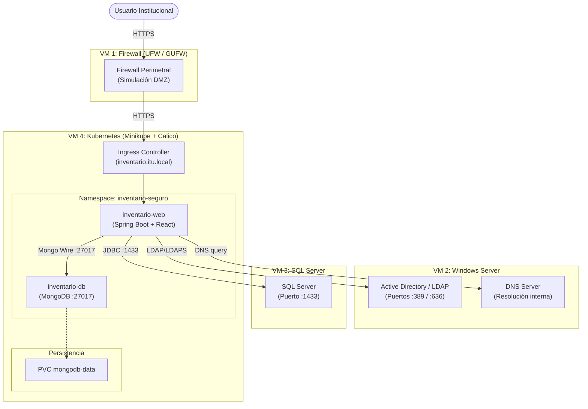
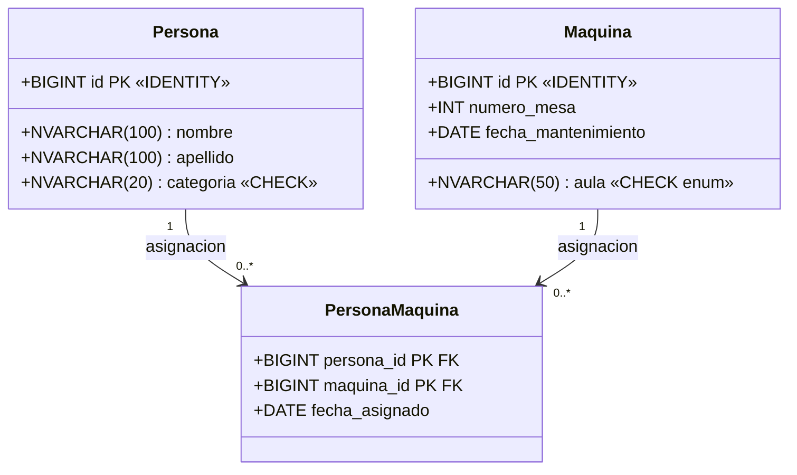
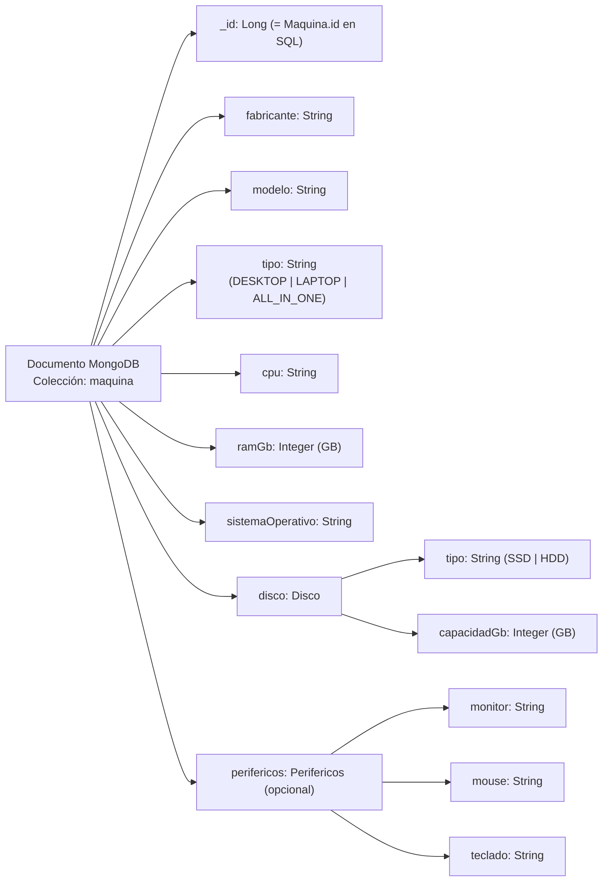
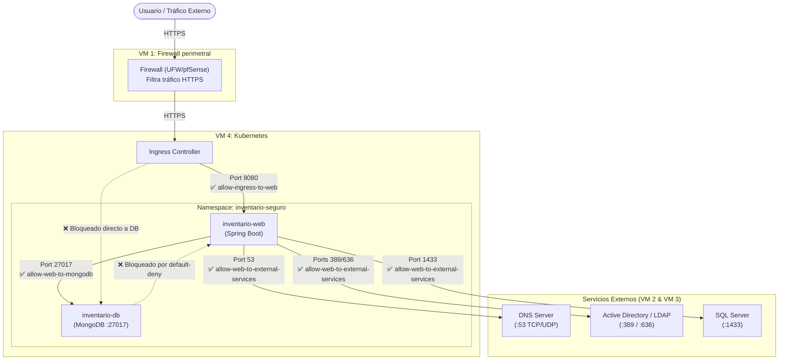
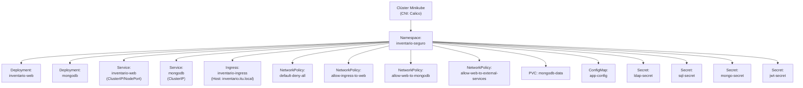

## 1. Introducción

El presente informe documenta el diseño, análisis y planificación del sistema denominado **Ecosistema de Inventario Seguro (EGI)**, desarrollado como proyecto integrador para la asignatura correspondiente del Instituto Tecnológico Universitario (ITU).

El problema central que motiva este proyecto es la necesidad de la universidad de contar con un sistema centralizado y seguro para inventariar las computadoras de sus laboratorios de informática. Actualmente, la gestión del inventario de hardware y la trazabilidad de ubicación y responsabilidad de cada equipo se realizan de forma manual o descentralizada, lo que implica riesgos de pérdida de información, dificultad para auditorías y falta de visibilidad operativa.

La solución propuesta contempla el desarrollo de una **aplicación web** que integre dos bases de datos heterogéneas (SQL Server y MongoDB) y un servidor de identidad centralizado (Active Directory/LDAP) mediante una **arquitectura híbrida** distribuida en 4 máquinas virtuales independientes, garantizando la separación de responsabilidades y simulando un entorno empresarial/institucional real protegido por un firewall perimetral.

---

## 2. Objetivos

### 2.1 Objetivo General

Desarrollar un ecosistema de software seguro y versionado que permita inventariar las computadoras de los laboratorios del ITU, cumpliendo con los principios de mínimo privilegio, autenticación centralizada, arquitectura Zero-Trust y separación de entornos mediante máquinas virtuales y orquestación con Kubernetes (Minikube).

### 2.2 Objetivos Específicos

- Diseñar e implementar una aplicación web capaz de consultar SQL Server (alojado en una VM externa dedicada) para obtener datos de ubicación y asignación de equipos, y MongoDB (contenerizado en Kubernetes) para obtener los datos de hardware.
- Integrar la autenticación de usuarios contra un servidor Active Directory/LDAP y resolución DNS interna en una VM dedicada de Windows Server.
- Desplegar los componentes de aplicación de forma contenerizada mediante Docker y orquestados con Kubernetes (Minikube con CNI Calico) dentro de una VM independiente.
- Implementar NetworkPolicies en Kubernetes que garanticen el principio de mínimo privilegio en el tráfico de red interno del clúster y en la comunicación saliente a servicios externos.
- Simular un perímetro de seguridad mediante un firewall perimetral (UFW/GUFW sobre Ubuntu Server o pfSense como alternativa) en una VM dedicada que simule la DMZ de la red universitaria.
- Versionar el proyecto completo en un repositorio Git con commits atómicos y organizados por responsabilidad.

---

## 3. Descripción del Sistema

### 3.1 Arquitectura General

La solución definitiva se basa en una **arquitectura híbrida** distribuida en **4 Máquinas Virtuales (VMs) independientes** para emular un entorno de red institucional real:

| Máquina Virtual | Tecnologías Principales | Responsabilidades / Función | Relación con el Clúster |
|---|---|---|---|
| **VM 1: Firewall** | Ubuntu Server, GUFW/UFW (o pfSense como alternativa) | Firewall perimetral, filtrado inicial de tráfico, simulación de DMZ institucional y punto de entrada seguro hacia Kubernetes. | **NO** forma parte del clúster. |
| **VM 2: Windows Server** | Active Directory, LDAP / LDAPS, DNS | Autenticación centralizada, gestión de usuarios/grupos institucionales y resolución de nombres (DNS) interna (ej: `dc01.itu.local`, `sql01.itu.local`, `inventario.itu.local`). | **NO** forma parte del clúster. |
| **VM 3: SQL Server** | Microsoft SQL Server | Base de datos relacional para la gestión de ubicaciones y asignaciones físicas de equipos. | **NO** forma parte del clúster. |
| **VM 4: Kubernetes** | Minikube, Calico CNI, Ingress NGINX | Hospedar únicamente componentes de aplicación contenerizados. | **Clúster Kubernetes**. |

Dentro del clúster Kubernetes (VM 4), en un namespace aislado denominado `inventario-seguro`, residen únicamente los siguientes elementos de aplicación:
- **`inventario-web`**: Aplicación monolítica en Spring Boot que empaqueta e integra el backend REST, la seguridad JWT, la comunicación LDAP y el frontend React compiled y servido desde `src/main/resources/static`. Se despliega como un único Deployment y un único Service.
- **MongoDB**: Base documental para las especificaciones de hardware. Permanece contenerizada con almacenamiento persistente vía PersistentVolumeClaims.
- **Ingress NGINX**: Punto único de entrada al clúster para resolver el host `inventario.itu.local` y redirigir las peticiones al servicio `inventario-web`.

### 3.2 Diagrama de Topología del Sistema



---

## 4. Modelización de Bases de Datos

### 4.1 Base de Datos SQL Server — `ubicacion-db`

Esta base de datos, alojada de manera externa en la **VM 3 (SQL Server)** (fuera del clúster Kubernetes), almacena la información de **ubicación física** de cada máquina y su **asignación a personas** (docentes, alumnos, técnicos responsables).

#### 4.1.1 Diagrama de Clases (Modelo Relacional)



#### 4.1.2 Descripción de Entidades

**Persona**
Representa a cualquier usuario institucional que puede tener equipos asignados: docentes, alumnos o responsables técnicos.
- `id`: Identificador único autoincremental.
- `nombre` / `apellido`: Datos identificatorios del individuo.
- `categoria`: Tipo de persona. Restringido mediante constraint `CHECK` a valores como `'docente'`, `'alumno'` o `'tecnico'`.

**Maquina**
Representa cada computadora física inventariada en los laboratorios.
- `id`: Identificador único autoincremental. Este mismo ID es la clave compartida con MongoDB.
- `numero_mesa`: Número del banco o mesa dentro del aula/laboratorio.
- `fecha_mantenimiento`: Fecha del último mantenimiento registrado.
- `aula`: Ubicación física del equipo. Restringida mediante constraint `CHECK` al enum `Aula`: `AULA_1y2`, `LABORATORIO_SO`, `LABORATORIO_REDES`, `AULA_4`.

**PersonaMaquina** *(Tabla de relación)*
Tabla de asociación que implementa la relación N:M entre `Persona` y `Maquina`, registrando las asignaciones temporales.
- `persona_id` y `maquina_id`: Clave primaria compuesta (también foráneas).
- `fecha_asignado`: Fecha en que se realizó la asignación.

### 4.2 Base de Datos MongoDB — `inventario-db`

MongoDB almacena los datos de **hardware interno** de cada equipo. Se utiliza una única colección denominada `maquinas`.

#### 4.2.1 Estructura del Documento (Schema)

El documento almacena los datos de hardware con objetos anidados para `disco` y `perifericos`, reemplazando los campos planos de String de la versión anterior.



#### 4.2.2 Ejemplo de Documento JSON

```json
{
  "_id": 10001,
  "fabricante": "Dell",
  "modelo": "OptiPlex 7090",
  "tipo": "DESKTOP",
  "cpu": "Intel Core i5-11500",
  "ramGb": 16,
  "sistemaOperativo": "Windows 11 Pro",
  "disco": {
    "tipo": "SSD",
    "capacidadGb": 512
  },
  "perifericos": {
    "monitor": "Dell P2422H 24\"",
    "mouse": "Dell MS116",
    "teclado": "Dell KB216"
  },
  "_class": "com.itu.egi.inventarioseguro.model.MaquinaHardware"
}
```

El campo `_id` del documento MongoDB es el mismo `Long` que el `id` de la tabla `Maquina` en SQL Server. Esto elimina la necesidad de un campo de referencia separado y permite que la aplicación recupere ambas fuentes de datos con una sola clave. Los campos `disco` y `perifericos` son objetos embebidos (no colecciones separadas). El campo `_class` es agregado automáticamente por Spring Data MongoDB.

Notar que el documento almacenado usa los nombres de campo de las clases Java (camelCase: `ramGb`, `sistemaOperativo`) y los valores del enum en mayúsculas (`DESKTOP`), porque así persiste Spring Data MongoDB. La API REST expone estos mismos datos en snake_case y con el tipo en minúsculas (`ram_gb`, `"desktop"`), pero esa conversión ocurre en la capa Jackson del backend, no en la base.

#### 4.2.3 Scripts de la colección (`migraciones/mongodb/`)

| Archivo | Propósito |
|---|---|
| `V1__create_maquina_collection.js` | Creación inicial de la colección con validador (esquema v1, histórico) |
| `V2__update_maquina_schema.js` | Actualiza el validador `$jsonSchema` al modelo vigente (objetos embebidos) vía `collMod` |
| `V3__seed_maquina_documents.js` | Inserta los documentos de hardware de las máquinas seed de SQL, con estructuras variadas |
| `documentos_maquina.json` | Los documentos seed en formato JSON plano (importable con `mongoimport`) |
| `demo_crud.js` | Demo re-ejecutable de las operaciones de la consigna: inserts con estructuras variadas, búsquedas filtradas (campos embebidos, `$exists`, regex), `updateOne`/`updateMany` y `deleteOne`/`deleteMany` |

Los scripts se ejecutan manualmente desde la línea de comandos contra la shell del contenedor, tal como exige la consigna:

```bash
docker exec -i egi-mongodb mongosh inventario_egi --quiet < migraciones/mongodb/V2__update_maquina_schema.js
docker exec -i egi-mongodb mongosh inventario_egi --quiet < migraciones/mongodb/V3__seed_maquina_documents.js
docker exec -i egi-mongodb mongosh inventario_egi --quiet < migraciones/mongodb/demo_crud.js
```

También es posible abrir una shell interactiva dentro del contenedor para ejecutar queries manualmente: `docker exec -it egi-mongodb mongosh inventario_egi`.

---

## 5. Flujo de la Aplicación

### 5.1 Flujograma General de la Aplicación Web


---

## 6. Seguridad y Políticas de Red

### 6.1 Modelo Zero-Trust con NetworkPolicies de Kubernetes

El clúster implementa un modelo de **denegación por defecto** (`default-deny-all`) dentro del namespace `inventario-seguro`: todo el tráfico interno y externo de los pods está bloqueado salvo que sea explícitamente permitido por una NetworkPolicy. Las políticas de red implementadas son:

1. **`default-deny-all`**: Bloquea todo el tráfico (ingress/egress) de forma predeterminada para todos los pods en el namespace.
2. **`allow-ingress-to-web`**: Permite tráfico entrante únicamente desde el Ingress Controller hacia el pod de `inventario-web` en el puerto 8080.
3. **`allow-web-to-mongodb`**: Permite tráfico de salida desde `inventario-web` y de entrada hacia `mongodb` en el puerto 27017.
4. **`allow-web-to-external-services`**: Permite tráfico de salida desde el pod `inventario-web` hacia el exterior del clúster para consumir los servicios alojados en las VMs externas (DNS, LDAP/LDAPS y SQL Server).



### 6.2 Reglas de Red Resumidas

| Origen | Destino | Puerto | NetworkPolicy / Mecanismo | Acción |
|---|---|---|---|---|
| Ingress Controller | `inventario-web` | 8080 | `allow-ingress-to-web` | ✅ Permitido |
| `inventario-web` | `inventario-db` (MongoDB) | 27017 | `allow-web-to-mongodb` | ✅ Permitido |
| `inventario-web` | DNS (VM 2) | 53 (TCP/UDP) | `allow-web-to-external-services` | ✅ Permitido |
| `inventario-web` | LDAP / LDAPS (VM 2) | 389 / 636 | `allow-web-to-external-services` | ✅ Permitido |
| `inventario-web` | SQL Server (VM 3) | 1433 | `allow-web-to-external-services` | ✅ Permitido |
| Cualquier pod | Cualquier destino interno/externo | Todos | `default-deny-all` | ❌ Denegado |

### 6.3 Autenticación y Autorización con Active Directory (VM 2)

Active Directory/LDAP **no está desplegado dentro de Kubernetes**. Se ejecuta de manera externa en la **VM 2 (Windows Server)**.
- El backend (`inventario-web` en Spring Boot) consume el servicio LDAP/LDAPS externo a través de la red simulada.
- Durante el proceso de autenticación, Spring Security obtiene los grupos de Active Directory a los que pertenece el usuario autenticado.
- Estos grupos institucionales se mapean en memoria a roles internos de la aplicación para determinar el nivel de acceso en la UI y la API REST:
  
| Grupo en Active Directory | Rol Interno Spring Security | Permisos asignados |
|---|---|---|
| `Grupo_BD_Laboratorio_A` | `ROLE_ADMIN` | Acceso total (lectura, escritura, edición y eliminación). |
| `Grupo_BD_Laboratorio_C` | `ROLE_EDITOR` | Lectura, creación y edición de datos de inventario. Sin permisos de eliminación. |
| `Grupo_BD_Laboratorio_R` | `ROLE_READONLY` | Acceso de solo lectura al panel y búsquedas. |

### 6.4 Seguridad y Acceso a MongoDB

A diferencia de la autenticación de usuarios, la base documental MongoDB (que reside contenerizada en Kubernetes) **no utiliza autenticación basada en usuarios LDAP**.
- El backend (`inventario-web`) se conecta a MongoDB mediante una **cuenta técnica** o credenciales administrativas exclusivas de la base de datos (almacenadas de forma segura en un Secret de Kubernetes).
- La autorización para interactuar con las colecciones de hardware se delega exclusivamente a la lógica del backend mediante **Spring Security**, asegurando que los usuarios solo puedan operar con MongoDB si poseen los roles de aplicación correspondientes (`ROLE_ADMIN` o `ROLE_EDITOR`).

### 6.5 Simulación Perimetral (VM 1 - Firewall)

El perímetro de seguridad se simula utilizando una máquina virtual dedicada (**VM 1 - Firewall**) corriendo **Ubuntu Server** con **GUFW/UFW** (o alternativamente **pfSense**).
- Este firewall perimetral actúa como el único punto de contacto con el exterior (simulación de DMZ institucional).
- Filtra el tráfico inicial permitiendo exclusivamente peticiones HTTPS entrantes y redirige de manera segura las solicitudes legítimas hacia el Ingress Controller de Kubernetes en la VM 4. Todo tráfico no autorizado explícitamente en el firewall es rechazado inmediatamente.

---

## 7. Infraestructura y Despliegue

### 7.1 Estructura de Manifiestos Kubernetes

Dentro del namespace `inventario-seguro` del clúster Kubernetes, se configuran únicamente los recursos indispensables para la aplicación y la base documental:



### 7.2 Consideraciones de Despliegue

- **CNI con Calico**: El clúster Minikube debe iniciarse obligatoriamente con el plugin Calico como CNI para que las políticas de red (`NetworkPolicies`) tengan efecto efectivo de bloqueo y filtrado:
  `minikube start --cni=calico`
- **Persistencia**: El PersistentVolumeClaim `mongodb-data` garantiza la persistencia de los datos documentales del hardware almacenados en MongoDB ante reinicios de los pods.
- **Gestión de Secretos**: Los datos sensibles de acceso (como credenciales de base de datos SQL Server, credenciales de LDAP, contraseñas de MongoDB y claves de firma JWT) se administran exclusivamente mediante **Secrets de Kubernetes** (`ldap-secret`, `sql-secret`, `mongo-secret`, `jwt-secret`), evitando el uso de variables de entorno expuestas en texto plano.
- **Exposición Externa**: La aplicación unificada `inventario-web` se expone externamente a través de un objeto **Ingress NGINX** configurado bajo el host `inventario.itu.local`. Todo el tráfico externo pasa primero por el Firewall perimetral (VM 1) antes de ingresar al Ingress Controller.
- **Conectividad a Servicios Externos**: El pod `inventario-web` utiliza el servidor DNS interno de la VM 2 (`dc01.itu.local`) para resolver los nombres de red de la VM de base de datos (`sql01.itu.local`) y de identidad.

### 7.3 Flujo de Integración y Despliegue Continuo (CI/CD)

La infraestructura base del ecosistema (el Firewall perimetral, la máquina virtual de Active Directory/DNS y la base de datos SQL Server) se considera **preexistente** y de administración independiente, por lo que su configuración o aprovisionamiento no forma parte de los procesos automáticos.

El pipeline automatizado mediante **GitHub Actions** se enfoca exclusivamente en la entrega de la capa de aplicación:
1. **Compilación del Frontend**: Build de la interfaz React y copia de los archivos estáticos generados al directorio `src/main/resources/static` del backend.
2. **Compilación del Backend**: Compilación de la aplicación de Spring Boot en conjunto con sus dependencias y ejecución de tests unitarios y de integración.
3. **Construcción de Imágenes**: Generación de la imagen de producción Docker para la aplicación unificada `inventario-web`.
4. **Publicación**: Envío de la imagen generada al registro de contenedores (Docker Hub o GitHub Packages).
5. **Despliegue automático (CD)**: Aplicación de los manifiestos actualizados en el clúster de Kubernetes para actualizar el Deployment `inventario-web` en caliente.

---

## 8. Estructura del Repositorio Git

El proyecto debe versionarse en un repositorio Git unificado con la siguiente estructura de directorios sugerida:

```
/
├── README.md
├── .env.example              # Plantilla de variables para docker compose (producción)
├── docker-compose.yml          # Frontend + backend + MongoDB (SQL Server en VM externa)
├── docker-compose.dev.yml      # SQL Server + MongoDB para desarrollo local
├── docker/
│   └── sqlserver/
│       └── init.sql            # Creación de BD para compose de desarrollo
├── docs/
│   ├── arquitectura.md
│   ├── diagrama_clases.png
│   ├── diagrama_topologia.png
│   └── flujograma_app.mmd
├── k8s/
│   ├── namespace.yaml
│   ├── deployments/
│   │   ├── inventario-web.yaml
│   │   └── mongodb.yaml
│   ├── services/
│   │   ├── inventario-web.yaml
│   │   └── mongodb.yaml
│   ├── ingress/
│   │   └── inventario-ingress.yaml
│   ├── network-policies/
│   │   ├── default-deny-all.yaml
│   │   ├── allow-ingress-to-web.yaml
│   │   ├── allow-web-to-mongodb.yaml
│   │   └── allow-web-to-external-services.yaml
│   ├── secrets/
│   │   └── secrets.yaml
│   └── storage/
│       └── mongodb-pvc.yaml
├── app/
│   ├── inventario-web/
│   │   ├── Dockerfile          # Spring Boot + frontend embebido (multi-stage)
│   │   ├── frontend/
│   │   │   └── src/
│   │   └── src/
├── migraciones/
│   ├── sql/
│   │   └── V0__create_database.sql  # Script para VM de SQL Server
│   └── mongodb/
└── firewall/
    └── reglas_gufw.md
```

El historial de commits debe reflejar la contribución individual de cada integrante y la evolución incremental del proyecto, siguiendo buenas prácticas de mensajes descriptivos y ramas de trabajo por funcionalidad.

---

## 9. División de Tareas del Equipo

| Integrante | Responsabilidad Principal |
|---|---|
| Integrante 1 | Diseño de arquitectura, diagrama de topología, manifiestos Kubernetes (Deployments y Services) |
| Integrante 2 | Modelado y creación de la base de datos SQL Server (`ubicacion-db`), script SQL |
| Integrante 3 | Diseño de colección MongoDB (`inventario-db`), documentos JSON, queries de prueba |
| Integrante 4 | Desarrollo de la aplicación web (`inventario-web`): frontend + API REST (Spring Boot) |
| Integrante 5 | Configuración del servidor LDAP, NetworkPolicies, simulación de firewall (GUFW), presentación |

---

## 10. Entregables del Proyecto

1. **Documentación técnica**: Informe con esquema de arquitectura, diagrama de clases, diagrama de topología, flujograma y reglas de red.
2. **Repositorio Git**: Código fuente versionado de la aplicación web, Dockerfiles, manifiestos Kubernetes, scripts SQL y documentos JSON de MongoDB.
3. **Ecosistema funcional en Minikube**: Todos los servicios levantados y comunicándose correctamente dentro del namespace, con NetworkPolicies activas.
4. **Aplicación web funcional**: Permite gestionar el inventario de aulas (CRUD completo, búsqueda, asignación de máquinas a personas).
5. **Presentación**: Diapositivas en formato PowerPoint o compatible, estructuradas para una defensa de 17 minutos por equipo.

---

## 11. Implementación del Backend

### 11.1 Estructura del proyecto Spring Boot

El backend se implementa como un monolito modular bajo `app/inventario-web/`, utilizando **Spring Boot 3.4.1** con **Java 17** y **Maven** como herramienta de construcción.

```
app/inventario-web/
├── pom.xml
└── src/main/java/com/itu/egi/inventarioseguro/
    ├── config/         DataSourceConfig — registra repositorios JPA y MongoDB en paquetes separados
    ├── model/          Entidades JPA, documento MongoDB y enums
    ├── repository/
    │   ├── sql/        Repositorios Spring Data JPA (SQL Server)
    │   └── mongo/      Repositorios Spring Data MongoDB
    ├── dto/            Objetos de transferencia de datos (request y response)
    ├── service/        Lógica de negocio
    └── controller/     Controladores REST (/api/*)
```

### 11.2 Dependencias principales

| Dependencia | Propósito |
|---|---|
| `spring-boot-starter-web` | API REST con Jackson |
| `spring-boot-starter-data-jpa` | ORM sobre SQL Server con Hibernate |
| `spring-boot-starter-data-mongodb` | Repositorios sobre MongoDB |
| `mssql-jdbc` | Driver JDBC para SQL Server |
| `flyway-core` + `flyway-sqlserver` | Migraciones automáticas al arrancar |
| `spring-boot-starter-validation` | Validación de DTOs con Jakarta Bean Validation |
| `lombok` | Reducción de boilerplate (getters, setters, constructores) |

### 11.3 Modelo de dominio

#### Entidades JPA (SQL Server)

- **`Persona`** — mapea la tabla `persona`. Categoría como enum `Categoria` (`RESPONSABLE_TECNICO`, `ALUMNO`, `DOCENTE`).
- **`Maquina`** — mapea la tabla `maquina`. Aula como enum `Aula` (`AULA_1y2`, `LABORATORIO_SO`, `LABORATORIO_REDES`, `AULA_4`).
- **`PersonaMaquina`** — mapea la tabla `persona_maquina`. Usa `@EmbeddedId` con `PersonaMaquinaId` por tener el campo adicional `fecha_asignado`.

#### Documento MongoDB

- **`MaquinaHardware`** — colección `maquina`. Su `_id` es el mismo `Long` que el `id` de la entidad `Maquina` en SQL Server, funcionando como clave compartida entre bases.

### 11.4 Endpoints REST

Todos los endpoints devuelven y aceptan JSON con naming en **snake_case** (configurable globalmente via Jackson `SNAKE_CASE`).

| Método | Ruta | Descripción |
|---|---|---|
| POST | `/api/auth/login` | Autenticación — devuelve `{username, token, role}` |
| GET | `/api/maquinas` | Lista completa: SQL + MongoDB + asignaciones combinados |
| GET | `/api/maquinas/{id}` | Detalle unificado por ID |
| POST | `/api/maquinas` | Crea máquina en SQL y su hardware en MongoDB, con asignaciones |
| PUT | `/api/maquinas/{id}` | Actualiza en ambas bases y reemplaza asignaciones |
| DELETE | `/api/maquinas/{id}` | Elimina de ambas bases |
| GET | `/api/personas` | Lista todas las personas |
| GET | `/api/personas/{id}` | Detalle de persona |
| POST | `/api/personas` | Crea persona |
| PUT | `/api/personas/{id}` | Actualiza persona |
| DELETE | `/api/personas/{id}` | Elimina persona |
| POST | `/api/asignaciones` | Asigna máquina a persona (standalone) |
| DELETE | `/api/asignaciones/{personaId}/{maquinaId}` | Desasigna |

#### Estructura de request/response de `/api/maquinas`

**GET /api/maquinas** — respuesta (array de):
```json
{
  "id": 1,
  "numero_mesa": 5,
  "fecha_mantenimiento": "2026-12-01",
  "aula": "LABORATORIO_SO",
  "especificaciones": {
    "maquina_id": 1,
    "fabricante": "Dell",
    "modelo": "OptiPlex 7090",
    "tipo": "desktop",
    "cpu": "Intel Core i5-11500",
    "ram_gb": 16,
    "disco": { "tipo": "SSD", "capacidad_gb": 512 },
    "sistema_operativo": "Windows 11 Pro",
    "perifericos": { "monitor": "Dell 24\"", "mouse": "Dell MS116", "teclado": "Dell KB216" }
  },
  "asignaciones": [
    {
      "persona": { "id": 1, "nombre": "Juan", "apellido": "Humeniuk", "categoria": "Docente" },
      "fecha_asignado": "2026-06-06"
    }
  ]
}
```

**POST /api/maquinas** — body esperado:
```json
{
  "aula": "LABORATORIO_SO",
  "numero_mesa": 5,
  "fecha_mantenimiento": "2026-12-01",
  "especificaciones": {
    "fabricante": "Dell",
    "modelo": "OptiPlex 7090",
    "tipo": "desktop",
    "cpu": "Intel Core i5-11500",
    "ram_gb": 16,
    "disco": { "tipo": "SSD", "capacidad_gb": 512 },
    "sistema_operativo": "Windows 11 Pro",
    "perifericos": { "monitor": "Dell 24\"", "mouse": "Dell MS116", "teclado": "Dell KB216" }
  },
  "asignaciones": [
    { "personaId": 1, "fecha_asignado": "2026-06-06" }
  ]
}
```

### 11.5 Gestión de migraciones (Flyway)

Al arrancar la aplicación, Flyway ejecuta automáticamente las migraciones en orden:

| Versión | Acción |
|---|---|
| V1 | Crea tabla `persona` con CHECK en `categoria` |
| V2 | Crea tabla `maquina` |
| V3 | Crea tabla `persona_maquina` (N:M) con índice en `maquina_id` |
| V4 | Elimina columna `laboratorio` y agrega CHECK enum `aula` |

### 11.6 Configuración de doble fuente de datos (JPA + MongoDB)

La coexistencia de Spring Data JPA y Spring Data MongoDB en la misma aplicación requiere una configuración explícita para evitar conflictos en la detección automática de repositorios. Esto se implementa en la clase `DataSourceConfig`:

```java
@Configuration
@EnableJpaRepositories(basePackages = "...repository.sql")
@EnableMongoRepositories(basePackages = "...repository.mongo")
public class DataSourceConfig {
    @Bean
    public MongoTemplate mongoTemplate(MongoDatabaseFactory factory) {
        MongoTemplate template = new MongoTemplate(factory);
        template.setSessionSynchronization(SessionSynchronization.NEVER);
        return template;
    }
}
```

El ajuste `SessionSynchronization.NEVER` es necesario para que Spring Data MongoDB no intente enlazar sus operaciones de escritura al ciclo de vida de las transacciones JPA activas (que gestionan SQL Server), lo que de otro modo causaría que las escrituras a MongoDB se descarten silenciosamente.

### 11.7 Entornos Docker

El repositorio incluye dos archivos Compose con propósitos distintos:

#### Desarrollo local — `docker-compose.dev.yml`

Levanta **solo las bases de datos** para trabajar con el backend y el frontend fuera de contenedores (IDE, `mvn spring-boot:run`, `npm run dev`):

| Servicio | Imagen | Puerto host | Credenciales |
|---|---|---|---|
| SQL Server 2022 | `mcr.microsoft.com/mssql/server:2022-latest` | 1433 | sa / `EGI_Password123!` |
| MongoDB 7 | `mongo:7` | **27018** | Sin autenticación |

Incluye un job `sqlserver-init` que ejecuta `docker/sqlserver/init.sql` para crear la base `inventario_egi` en el primer arranque.

MongoDB se expone en el **puerto 27018** (no 27017) para evitar conflictos con instalaciones locales del servicio MongoDB.

```bash
docker compose -f docker-compose.dev.yml up -d
```

#### Despliegue — `docker-compose.yml`

Levanta la **aplicación** (Spring Boot con frontend embebido) y **MongoDB**. **SQL Server no se dockeriza**: corre en una VM externa y el backend se conecta mediante `DB_URL` en `.env`.

El frontend React se compila durante `mvn package` (`frontend-maven-plugin`) hacia `src/main/resources/static` y se sirve desde el mismo puerto que la API. **Un solo contenedor de aplicación**, sin nginx separado.

| Servicio | Dónde corre | Puerto (ejemplo) |
|---|---|---|
| App (Spring Boot + UI) | Contenedor Docker | 8080 |
| MongoDB | Contenedor Docker | red interna `mongodb:27017` |
| SQL Server | **VM externa** | 1433 (configurado en `DB_URL`) |

```bash
cp .env.example .env
# Editar DB_URL y DB_PASSWORD con la VM de SQL Server
docker compose up --build -d
# App completa: http://localhost:8080
# API:          http://localhost:8080/api
```

Durante el build Docker, `VITE_API_URL=/api` (ruta relativa, misma origin). No se requiere CORS en producción embebida.

##### Preparar SQL Server (VM externa)

1. Instalar SQL Server en la VM y abrir el puerto **1433** hacia el host donde corre Docker.
2. Crear la base de datos (una sola vez):

```bash
sqlcmd -S localhost -U sa -P '<password>' -C -i migraciones/sql/V0__create_database.sql
```

3. Configurar la conexión en `.env` (ver sección 11.8).

Flyway aplica las migraciones V1–V4 automáticamente al arrancar el backend.

##### Probar el compose de producción sin VM externa

Para desarrollo integrado, levantar SQL Server con el compose de desarrollo y apuntar el backend al host:

```bash
docker compose -f docker-compose.dev.yml up -d
cp .env.example .env
# En .env:
# DB_URL=jdbc:sqlserver://host.docker.internal:1433;databaseName=inventario_egi;encrypt=false;trustServerCertificate=true
# DB_PASSWORD=EGI_Password123!
docker compose up --build -d
```

##### Seed de MongoDB (opcional)

```bash
docker compose exec -T mongodb mongosh inventario_egi --quiet < migraciones/mongodb/V3__seed_maquina_documents.js
```

### 11.8 Configuración de entorno

La aplicación se configura mediante variables de entorno para no hardcodear credenciales. El archivo `.env.example` en la raíz del repositorio documenta todas las variables del despliegue Docker; copiarlo a `.env` antes de `docker compose up`.

#### Backend (Spring Boot)

| Variable | Valor por defecto | Descripción |
|---|---|---|
| `DB_URL` | `jdbc:sqlserver://localhost:1433;databaseName=inventario_egi;...` | URL JDBC completa hacia SQL Server. En producción apunta a la VM externa |
| `DB_USER` | `sa` | Usuario SQL Server |
| `DB_PASSWORD` | `sa` | Contraseña SQL Server |
| `MONGO_URI` | `mongodb://localhost:27018/inventario_egi` | URI MongoDB. En Docker: `mongodb://mongodb:27017/inventario_egi` |
| `CORS_ALLOWED_ORIGINS` | `http://localhost:3000` | Orígenes CORS (solo necesario en dev con Vite en `:3000`) |

En `application.yml`, la URL de SQL Server se resuelve desde `DB_URL`:

```yaml
spring:
  datasource:
    url: ${DB_URL:jdbc:sqlserver://localhost:1433;databaseName=inventario_egi;encrypt=false;trustServerCertificate=true}
    username: ${DB_USER:sa}
    password: ${DB_PASSWORD:sa}
```

#### Frontend embebido (build)

El frontend se compila con `VITE_API_URL=/api` (configurado en `pom.xml` y en el Dockerfile). En producción embebida la API se llama con ruta relativa; no hace falta configurar `VITE_*` en el `.env` de Docker.

Para desarrollo local con Vite (`npm run dev` en `:3000`), usar `app/inventario-web/frontend/.env.local`:

```env
VITE_API_URL=http://localhost:8080/api
VITE_USE_MOCK=false
```

---

## 12. Frontend — Aplicación React

### 12.1 Tecnologías

La interfaz web está implementada con **React 19 + TypeScript + Vite + Tailwind CSS**, ubicada en `app/inventario-web/frontend/`.

| Tecnología | Versión | Rol |
|---|---|---|
| React + TypeScript | 19 / 5.8 | UI y tipado estático |
| Vite | 6 | Build tool y dev server (puerto 3000) |
| Tailwind CSS | 4 | Estilos utilitarios |
| Lucide React | 0.546 | Iconografía |

### 12.2 Arquitectura de servicios

El frontend implementa una capa de servicios en `src/services/` que abstrae la comunicación con el backend:

| Archivo | Responsabilidad |
|---|---|
| `api.ts` | Cliente base HTTP con inyección automática de JWT en el header `Authorization: Bearer <token>` |
| `authService.ts` | Login contra `/api/auth/login`, persistencia del token en `localStorage` |
| `maquinaService.ts` | CRUD completo contra `/api/maquinas` y `/api/personas` |

### 12.3 Modo Mock vs. Real

El frontend soporta dos modos controlados por variables de entorno:

```env
# Producción embebida: fallback /api (no requiere configuración)
# Desarrollo con Vite (:3000 → API :8080):
VITE_API_URL=http://localhost:8080/api
VITE_USE_MOCK=false

# Modo mock (datos en localStorage, sin backend)
VITE_USE_MOCK=true
```

| Archivo | Cuándo usarlo |
|---|---|
| `app/inventario-web/frontend/.env.local` | Desarrollo local con `npm run dev` |
| Build embebido (`mvn package` / Docker) | `VITE_API_URL=/api` automático via `pom.xml` |

El modo mock simula con fidelidad el comportamiento del backend (transacciones SQL + MongoDB) usando `localStorage`, lo que permite desarrollar el frontend de forma independiente.

### 12.4 Levantar el frontend

```bash
cd app/inventario-web/frontend
npm install
npm run dev        # http://localhost:3000
```

Credenciales por defecto para el login: `admin` / `admin123` (o cualquier usuario/contraseña mientras el LDAP real esté pendiente).

---

## 13. Integración Backend-Frontend

### 13.1 CORS

La clase `CorsConfig` habilita CORS para desarrollo con Vite (`npm run dev` en `:3000` → API en `:8080`). En producción embebida (todo en `:8080`) no es necesario. Orígenes configurables via `CORS_ALLOWED_ORIGINS`:

```java
@Value("${CORS_ALLOWED_ORIGINS:http://localhost:3000}")
private String[] allowedOrigins;
```

### 13.2 Convención de naming JSON

Jackson está configurado globalmente con la estrategia `SNAKE_CASE` en `application.yml`:

```yaml
spring:
  jackson:
    property-naming-strategy: SNAKE_CASE
```

Esto convierte automáticamente los campos camelCase de Java (`numeroMesa`, `ramGb`, `sistemaOperativo`) a snake_case en el JSON (`numero_mesa`, `ram_gb`, `sistema_operativo`), alineándose con la convención del frontend.

### 13.3 Autenticación (mock JWT)

El endpoint `POST /api/auth/login` devuelve un token de sesión. La integración con el servidor LDAP real (OpenLDAP / Active Directory) está pendiente; por ahora, el endpoint acepta cualquier credencial y retorna un token aleatorio:

```json
{
  "username": "admin",
  "token": "mock-jwt-uuid-generado",
  "role": "ADMIN"
}
```

El rol se determina según el username: `admin` → `ADMIN`, cualquier otro → `TECNICO`.

### 13.4 Validación del contrato de API

La integración fue verificada con Playwright (Chromium headless):

| Check | Resultado |
|---|---|
| Login con `admin/admin123` | ✅ `POST /api/auth/login → 200` |
| Dashboard carga máquinas reales | ✅ `GET /api/maquinas → 200` |
| Lista de personas para selector | ✅ `GET /api/personas → 200` |
| Crear máquina desde formulario | ✅ `POST /api/maquinas → 201` |
| Errores CORS en consola del navegador | ✅ 0 errores |
| Errores de JavaScript en consola | ✅ 0 errores |

---

## 14. Tests

### 14.1 Estrategia de testing

Se implementaron **17 tests** divididos en tres niveles, sin requerir bases de datos externas:

| Tipo | Clase | Tests | Herramienta |
|---|---|---|---|
| Unitario (service) | `MaquinaServiceTest` | 7 | JUnit 5 + Mockito |
| Integración HTTP (controller) | `MaquinaControllerTest` | 6 | `@WebMvcTest` + MockMvc |
| Integración HTTP (auth) | `AuthControllerTest` | 3 | `@WebMvcTest` + MockMvc |
| Placeholder | `InventarioApplicationTests` | 1 | — |

### 14.2 Casos cubiertos

**MaquinaServiceTest** — lógica de negocio:
- `findAll` devuelve lista con datos de SQL + MongoDB combinados
- `findAll` con MongoDB vacío devuelve especificaciones en null sin crashear
- `findById` happy path con datos completos
- `findById` ID inexistente → 404
- `create` persiste en SQL Server Y en MongoDB
- `delete` elimina de ambas bases
- `delete` ID inexistente → 404 sin tocar las bases

**MaquinaControllerTest** — capa HTTP:
- `GET /api/maquinas` → 200 con JSON en snake_case (`numero_mesa`, `ram_gb`, `sistema_operativo`, `capacidad_gb`)
- `GET /api/maquinas/{id}` → 200 con estructura completa
- `POST /api/maquinas` con body válido → 201
- `POST /api/maquinas` sin `especificaciones` (@NotNull) → 400
- `PUT /api/maquinas/{id}` → 200
- `DELETE /api/maquinas/{id}` → 204

**AuthControllerTest** — autenticación:
- Usuario `admin` → role `ADMIN`
- Cualquier otro usuario → role `TECNICO`
- Body vacío → respuesta 200 con token

### 14.3 Ejecutar los tests

```bash
cd app/inventario-web
mvn test
# BUILD SUCCESS — Tests run: 17, Failures: 0, Errors: 0, Skipped: 0
```

Los tests de controller (`@WebMvcTest`) y los unitarios (Mockito) no requieren Docker ni bases de datos.

---

## 15. Conclusión

El proyecto EGI representa un ejercicio integral de ingeniería de sistemas, abarcando desde el análisis y diseño de bases de datos relacionales y documentales, hasta la implementación de seguridad perimetral, autenticación centralizada y orquestación de contenedores. La arquitectura propuesta es escalable, segura por diseño y alineada con los principios modernos de infraestructura como código y Zero-Trust Networking.

La distribución del trabajo en cinco roles complementarios garantiza que el equipo aborde todas las capas del ecosistema, y la defensa individual de cada parte refuerza la apropiación del conocimiento por parte de cada integrante.

---

*Documento generado para el Proyecto Integrador de la asignatura EGI — Instituto Tecnológico Universitario*
