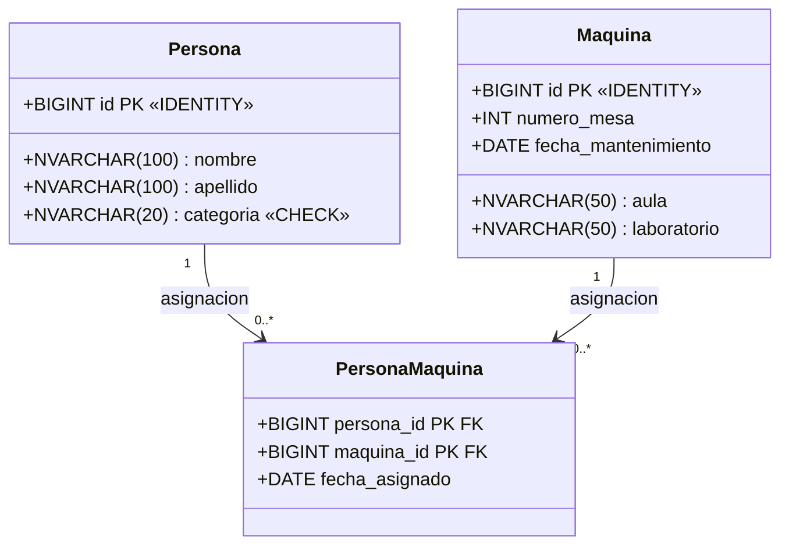
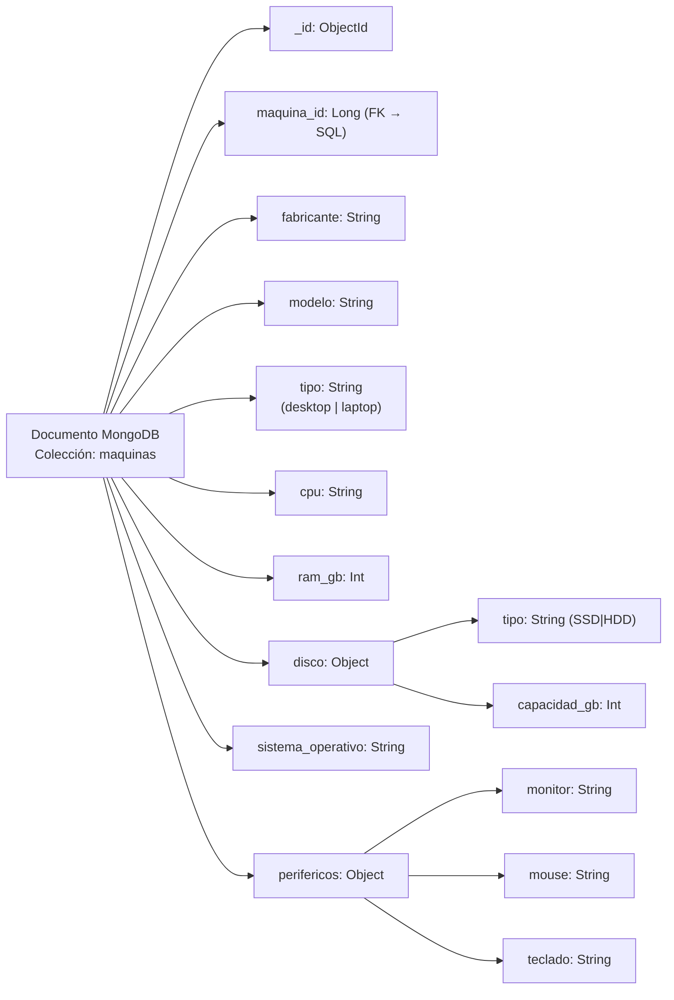
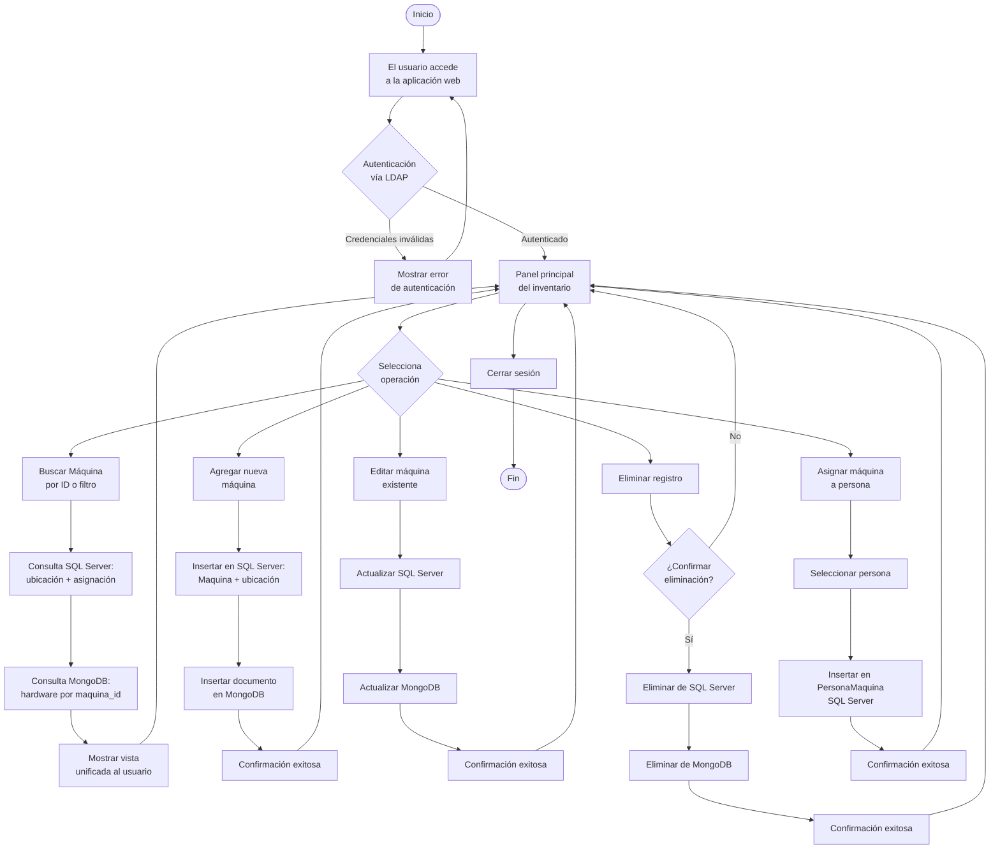
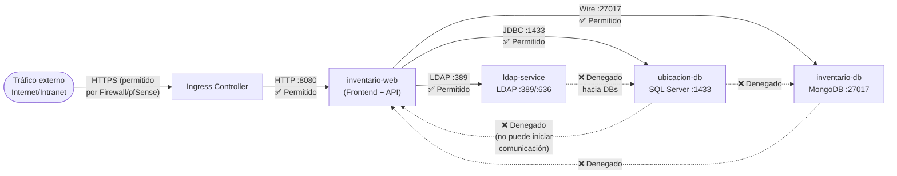

## 1. Introducción

El presente informe documenta el diseño, análisis y planificación del sistema denominado **Ecosistema de Inventario Seguro (EGI)**, desarrollado como proyecto integrador para la asignatura correspondiente del Instituto Tecnológico Universitario (ITU).

El problema central que motiva este proyecto es la necesidad de la universidad de contar con un sistema centralizado y seguro para inventariar las computadoras de sus laboratorios de informática. Actualmente, la gestión del inventario de hardware y la trazabilidad de ubicación y responsabilidad de cada equipo se realizan de forma manual o descentralizada, lo que implica riesgos de pérdida de información, dificultad para auditorías y falta de visibilidad operativa.

La solución propuesta contempla el desarrollo de una **aplicación web** que integre dos bases de datos heterogéneas (SQL Server y MongoDB), un servidor de identidad centralizado (Active Directory/LDAP), y un despliegue contenerizado sobre Kubernetes (Minikube), cumpliendo con estrictas políticas de seguridad perimetral simuladas mediante GUFW/pfSense.

---

## 2. Objetivos

### 2.1 Objetivo General

Desarrollar un ecosistema de software seguro, contenerizado y versionado que permita inventariar las computadoras de los laboratorios del ITU, cumpliendo con los principios de mínimo privilegio, autenticación centralizada y arquitectura Zero-Trust.

### 2.2 Objetivos Específicos

- Diseñar e implementar una aplicación web capaz de consultar SQL Server para obtener datos de ubicación y asignación de equipos, y MongoDB para obtener los datos de hardware.
- Configurar un servidor Active Directory/LDAP para la autenticación centralizada de usuarios.
- Desplegar todos los componentes del sistema de forma contenerizada mediante Docker y orquestados con Kubernetes (Minikube con CNI Calico).
- Implementar NetworkPolicies de Kubernetes que garanticen el principio de mínimo privilegio en el tráfico de red interno del clúster.
- Simular un perímetro de seguridad mediante GUFW/pfSense que emule el entorno de firewall universitario.
- Versionar el proyecto completo en un repositorio Git con commits atómicos y organizados por responsabilidad.

---

## 3. Descripción del Sistema

### 3.1 Arquitectura General

El ecosistema está compuesto por cinco servicios principales, todos desplegados dentro de un clúster Kubernetes (Minikube) en un namespace aislado denominado `inventario-seguro`:

| Servicio | Tecnología | Puerto | Función |
|---|---|---|---|
| `inventario-web` | Spring Boot (Frontend + API REST) | 8080 (HTTP) | Interfaz gráfica y capa de negocio |
| `ubicacion-db` | SQL Server | 1433 (JDBC) | Datos de ubicación y asignación |
| `inventario-db` | MongoDB | 27017 (Mongo Wire) | Datos de hardware de cada equipo |
| `ldap-service` | OpenLDAP / Active Directory | 389 (LDAP) / 636 (LDAPS) | Autenticación institucional |
| Firewall / DMZ | GUFW / pfSense | — | Perímetro de seguridad perimetral |

El tráfico externo proveniente del usuario institucional ingresa vía HTTPS al perímetro (Firewall/DMZ), que filtra y reenvía las solicitudes legítimas al **Ingress Controller** del clúster Kubernetes. Desde allí, el tráfico se dirige exclusivamente al frontend (`inventario-web`), que es el único servicio con acceso a la capa de datos.

### 3.2 Diagrama de Topología del Sistema


---

## 4. Modelización de Bases de Datos

### 4.1 Base de Datos SQL Server — `ubicacion-db`

Esta base de datos almacena la información de **ubicación física** de cada máquina y su **asignación a personas** (docentes, alumnos, técnicos responsables).

#### 4.1.1 Diagrama de Clases (Modelo Relacional)



#### 4.1.2 Descripción de Entidades

**Persona**
Representa a cualquier usuario institucional que puede tener equipos asignados: docentes, alumnos o responsables técnicos.
- `id`: Identificador único autoincremental.
- `nombre` / `apellido`: Datos identificatorios del individuo.
- `categoria`: Tipo de persona. Restringido mediante constraint `CHECK` a valores como `'docente'`, `'alumno'` o `'tecnico'`.

**Maquina**
Representa cada computadora física inventariada en los laboratorios.
- `id`: Identificador único autoincremental. Este mismo ID se utiliza como referencia en MongoDB para recuperar los datos de hardware.
- `numero_mesa`: Número del banco o mesa dentro del aula/laboratorio.
- `fecha_mantenimiento`: Fecha del último mantenimiento registrado.
- `aula` / `laboratorio`: Ubicación física del equipo dentro de las instalaciones.

**PersonaMaquina** *(Tabla de relación)*
Tabla de asociación que implementa la relación N:M entre `Persona` y `Maquina`, registrando las asignaciones temporales.
- `persona_id` y `maquina_id`: Clave primaria compuesta (también foráneas).
- `fecha_asignado`: Fecha en que se realizó la asignación.

### 4.2 Base de Datos MongoDB — `inventario-db`

MongoDB almacena los datos de **hardware interno** de cada equipo. Se utiliza una única colección denominada `maquinas`.

#### 4.2.1 Estructura del Documento (Schema)



#### 4.2.2 Ejemplo de Documento JSON

```json
{
  "_id": { "$oid": "665f1a2b3c4d5e6f7a8b9c0d" },
  "maquina_id": 42,
  "fabricante": "Dell",
  "modelo": "OptiPlex 7090",
  "tipo": "desktop",
  "cpu": "Intel Core i7-11700",
  "ram_gb": 16,
  "disco": {
    "tipo": "SSD",
    "capacidad_gb": 512
  },
  "sistema_operativo": "Windows 10 Pro",
  "perifericos": {
    "monitor": "Dell P2422H 24\"",
    "mouse": "Dell MS116",
    "teclado": "Dell KB216"
  }
}
```

El campo `maquina_id` actúa como **clave foránea lógica** hacia la tabla `Maquina` de SQL Server, permitiendo que la aplicación web combine ambas fuentes de datos en una vista unificada del inventario.

---

## 5. Flujo de la Aplicación

### 5.1 Flujograma General de la Aplicación Web



---

## 6. Seguridad y Políticas de Red

### 6.1 Modelo Zero-Trust con NetworkPolicies de Kubernetes

El clúster implementa un modelo de **denegación por defecto**: todo el tráfico dentro del namespace `inventario-seguro` está bloqueado salvo que sea explícitamente permitido por una NetworkPolicy. Las reglas definidas son:



### 6.2 Reglas de Red Resumidas

| Origen | Destino | Puerto | Acción |
|---|---|---|---|
| Ingress Controller | `inventario-web` | 8080 | ✅ Permitido |
| `inventario-web` | `ubicacion-db` | 1433 | ✅ Permitido |
| `inventario-web` | `inventario-db` | 27017 | ✅ Permitido |
| `inventario-web` | `ldap-service` | 389 / 636 | ✅ Permitido |
| Cualquier otro pod | `ubicacion-db` | 1433 | ❌ Denegado |
| Cualquier otro pod | `inventario-db` | 27017 | ❌ Denegado |
| Cualquier otro pod | `ldap-service` | 389/636 | ❌ Denegado |
| Tráfico sin autorización de DMZ | Ingress | — | ❌ Denegado (Firewall) |

### 6.3 Simulación Perimetral

Se utiliza **GUFW** (interfaz gráfica de UFW) para simular el comportamiento del firewall perimetral universitario. Las reglas configuradas permiten únicamente tráfico HTTPS entrante hacia la IP asignada por Minikube, emulando el NAT del pfSense institucional. Todo tráfico no explícitamente autorizado es bloqueado en esta capa antes de alcanzar el clúster.

---

## 7. Infraestructura y Despliegue

### 7.1 Estructura de Manifiestos Kubernetes

```mermaid
graph TD
    K8S["Clúster Minikube\n(CNI: Calico)"]
    
    K8S --> NS["Namespace:\ninventario-seguro"]
    
    NS --> DEP1["Deployment:\ninventario-web"]
    NS --> DEP2["Deployment:\nubicacion-db"]
    NS --> DEP3["Deployment:\ninventario-db"]
    NS --> DEP4["Deployment:\nldap-service"]

    NS --> SVC1["Service:\ninventario-web\n(NodePort/LoadBalancer)"]
    NS --> SVC2["Service:\nubicacion-db\n(ClusterIP)"]
    NS --> SVC3["Service:\ninventario-db\n(ClusterIP)"]
    NS --> SVC4["Service:\nldap-service\n(ClusterIP)"]

    NS --> NP1["NetworkPolicy:\ndefault-deny-all"]
    NS --> NP2["NetworkPolicy:\nallow-frontend-egress"]
    NS --> NP3["NetworkPolicy:\nallow-db-from-frontend"]
    NS --> NP4["NetworkPolicy:\nallow-ldap-from-frontend"]

    NS --> PVC1["PVC: sqlserver-data"]
    NS --> PVC2["PVC: mongodb-data"]
    NS --> PVC3["PVC: ldap-data"]

    NS --> CM1["ConfigMap:\napp-config"]
    NS --> SEC1["Secret:\ndb-credentials"]
    NS --> SEC2["Secret:\nldap-credentials"]
```



### 7.2 Consideraciones de Despliegue

- El clúster debe iniciarse con Calico como CNI para que las NetworkPolicies tengan efecto efectivo:
  `minikube start --cni=calico`
- Los PersistentVolumeClaims garantizan la persistencia de datos de las bases de datos y del directorio LDAP ante reinicios de los pods.
- Las credenciales de acceso a las bases de datos y al servidor LDAP se gestionan mediante **Secrets de Kubernetes**, nunca como variables de entorno en texto plano dentro de los Deployments.
- El frontend (`inventario-web`) es el único servicio expuesto externamente mediante un Service de tipo `NodePort` o a través del Ingress Controller.

---

## 8. Estructura del Repositorio Git

El proyecto debe versionarse en un repositorio Git unificado con la siguiente estructura de directorios sugerida:

```
/
├── README.md
├── docs/
│   ├── arquitectura.md
│   ├── diagrama_clases.png
│   ├── diagrama_topologia.png
│   └── flujograma_app.mmd
├── k8s/
│   ├── namespace.yaml
│   ├── deployments/
│   │   ├── inventario-web.yaml
│   │   ├── ubicacion-db.yaml
│   │   ├── inventario-db.yaml
│   │   └── ldap-service.yaml
│   ├── services/
│   │   └── *.yaml
│   ├── network-policies/
│   │   ├── default-deny-all.yaml
│   │   ├── allow-frontend.yaml
│   │   └── allow-db-from-frontend.yaml
│   └── storage/
│       └── pvc.yaml
├── app/
│   ├── inventario-web/
│   │   ├── Dockerfile
│   │   └── src/
├── db/
│   ├── sql/
│   │   └── create_schema.sql
│   └── mongo/
│       └── seed_data.json
└── firewall/
    └── reglas_gufw.md
```

El historial de commits debe reflejar la contribución individual de cada integrante y la evolución incremental del proyecto, siguiendo buenas prácticas de mensajes descriptivos y ramas de trabajo por funcionalidad.

---

## 9. División de Tareas del Equipo

| Integrante | Responsabilidad Principal |
|---|---|
| Integrante 1 | Diseño de arquitectura, diagrama de topología, manifiestos Kubernetes (Deployments y Services) |
| Integrante 2 | Modelado y creación de la base de datos SQL Server (`ubicacion-db`), script SQL |
| Integrante 3 | Diseño de colección MongoDB (`inventario-db`), documentos JSON, queries de prueba |
| Integrante 4 | Desarrollo de la aplicación web (`inventario-web`): frontend + API REST (Spring Boot) |
| Integrante 5 | Configuración del servidor LDAP, NetworkPolicies, simulación de firewall (GUFW), presentación |

---

## 10. Entregables del Proyecto

1. **Documentación técnica**: Informe con esquema de arquitectura, diagrama de clases, diagrama de topología, flujograma y reglas de red.
2. **Repositorio Git**: Código fuente versionado de la aplicación web, Dockerfiles, manifiestos Kubernetes, scripts SQL y documentos JSON de MongoDB.
3. **Ecosistema funcional en Minikube**: Todos los servicios levantados y comunicándose correctamente dentro del namespace, con NetworkPolicies activas.
4. **Aplicación web funcional**: Permite gestionar el inventario de aulas (CRUD completo, búsqueda, asignación de máquinas a personas).
5. **Presentación**: Diapositivas en formato PowerPoint o compatible, estructuradas para una defensa de 17 minutos por equipo.

---

## 11. Conclusión

El proyecto EGI representa un ejercicio integral de ingeniería de sistemas, abarcando desde el análisis y diseño de bases de datos relacionales y documentales, hasta la implementación de seguridad perimetral, autenticación centralizada y orquestación de contenedores. La arquitectura propuesta es escalable, segura por diseño y alineada con los principios modernos de infraestructura como código y Zero-Trust Networking.

La distribución del trabajo en cinco roles complementarios garantiza que el equipo aborde todas las capas del ecosistema, y la defensa individual de cada parte refuerza la apropiación del conocimiento por parte de cada integrante.

---

*Documento generado para el Proyecto Integrador de la asignatura EGI — Instituto Tecnológico Universitario*
